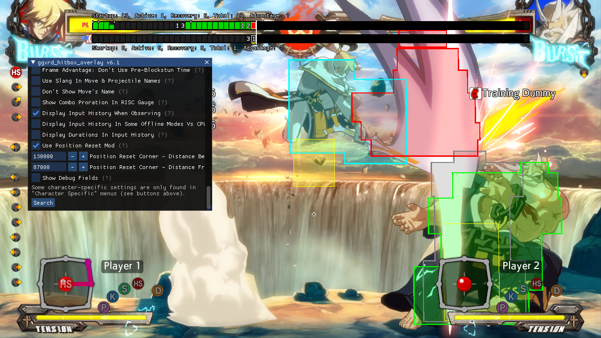

# ggxrd_hitbox_overlay_2211



## Description

Adds hitboxes overlaid on top of characters/projectiles for Guilty Gear Xrd Rev2 version 2211 (as of 13'th November 2023).

## Credits

Original version created by Altimor: <http://www.dustloop.com/forums/index.php?/forums/topic/12495-xrd-pc-hitbox-overlay-mod/>  
Created in 2016.  
This version is adapted for Guilty Gear Xrd Rev2 version 2211 with the full featureset of the original.

Many thanks to WorseThanYou, without whose help this wouldn't have been possible.

## System requirements

Intel processor architecture x86 (32-bit) or x64 (64-bit) (AMD will work). Windows operating system.

## Quickstart

1. Launch the game. Or you can do the next step at any point while the game is running.

2. Go to downloaded folder and launch `ggxrd_hitbox_injector.exe`.

3. Start a match. Hitboxes should display.

Read the `Features` section to understand what the colors mean and what the hotkeys are.  
You can also play the game frame-by-frame (described in `Features`).

To turn off the mod you can launch `ggxrd_hitbox_injector.exe` again.  
If trying to use the mod with a game version that it doesn't fit, the game may crash. The mod should be possible to combine with other mods, but there might be some mods that can't be combined with this one (if they hook or sigscan the same functions).

The mod may show up as a virus. I swear this is not a virus, check the source code, compile this yourself if still doubting. Check commit history of this repo to see no one else but me modified this. Add this to whatever antivirus exceptions necessary and run as administrator if necessary.

## Features

### Green - Hurtboxes

Normally hurtboxes display in green. The rules in general are such, that when a hitbox (red) makes contact with hurtbox, a hit occurs.

### Light blue - Would-be counterhit hurtboxes

If your hurtbox is displaying light blue, that means, should you get hit, you would enter counterhit state. It means that moves that have light blue hurtbox on recovery are more punishable.

### Gray - Pre-hit hurtboxes

When you get hit a gray outline appears on top of your current hurtbox. This outline represents the previous state of your hurtbox, before you got hit. Its purpose is to make it easier to see how or why you got hit.

### Yellow - Pushboxes

Each player has a pushbox. When two pushboxes collide, the players get pushed apart until their pushboxes no longer collide. Pushbox widths also affect throw range - more on that in next section(s).

### Point/Cross - Origin points

Each player and entity has an origin point which is shown as a black-white cross on the ground between their feet. When players jump, the origin point tracks their location. Origin points play a key role in throw hit detection.

### Blue - Rejection boxes

When a Blitz Shield meets a projectile it displays a square blue box around the rejecting player, and if the opponent's origin point is within that box the opponent enters rejected state. The box does not show when rejecting normal, melee attacks because those cause rejection no matter the distance. Pushboxes and their sizes do not affect the distance check in any way, i.e. only the X and Y distances between the players' origin points are checked.

### Blue - Throw boxes

When a player does a throw he displays a throw box in blue color. Throw boxes are usually only active for one frame (that's when they display semi-transparent). This period is so brief throw boxes have to show for a few extra frames, but during those frames they're no longer active and so they display fully transparent (outline only).  
In this adaptation of Altimor's original mod, throw boxes must include the opponent's origin point in order to connect (but that's not all, read on). That means that the sizes of your and your opponent's pushboxes affect the width of your throw box. Try crouching and see how your pushbox becomes wider a bit. This means crouching opponents are slightly easier to throw. Or Potemkin - he has a wider pushbox than average.  
It's in the rules of the game that ground throws may only connect with non-airborne opponents and air throws may only connect with airborne opponents. Opponents who are in prejump state cannot be ground thrown.  
Most normal ground throws and ground command throws for this reason do not limit their throw boxes vertically: the throw box shows as a pillar reaching vertically over the entire screen's height. This doesn't mean they capture anything above or below the thrower, though, and the rules mentioned above are still being obeyed.  
Some throws check for vertical position of the opponent's origin point and so display their throw box limited in size vertically.  
When visually checking to see if a throw box would connect with an opponent you should, in this mod, ignore the pushboxes altogether and focus only on the throw box catching the origin point.  
Note that normal ground throw actually simply checks if distance between the pushboxes is below the attacker's throw range (values listed on Dustloop), however some throws like command throws or air throws also check if the origin point specifically is within x or y range. Hence this is why I decided to just always show the check on the origin point only.  
If a command throw has a throw box as well as hitbox, such as Raven's command throw, - for such moves I haven't fully studied the conditions under which they connect - but it's likely that both the throw box and the hitbox must connect.

### Frame-by-frame animation playback

You can force the game to play one frame at a time (in training mode only). Read on in `F3 - Freeze game` secion and sections after that.

### F1 - GIF mode

In training mode (only) you can press F1 to enter "GIF mode", which makes the background black, centers the camera on you, hides some of the HUD (you have to hide the rest yourself via Menu - Display settings) and makes opponent invisible and unhittable.  
Press the key again to turn off the mode.  
Section "Hotkey configuration" describes how to configure hotkeys.

### F2 - No gravity mode

In training mode (only) you can press F2 to enter "No gravity mode" which makes your vertical speed always 0, i.e. you become unable to fall. This may be useful for screenshotting some air moves.  
Press the key again to turn off the mode.  
Section "Hotkey configuration" describes how to configure hotkeys.

### F3 - Freeze game

Freezes the game and stops animations and game logic from advancing.  
Section "Hotkey configuration" describes how to configure hotkeys.

### F4 - Slow-motion mode

Plays the game at 3 times (the default) slower rate. You configure the rate in settings (read on in `Hotkey configuration`), but the `slowmoTimes` must be a whole, round number greater than 1. I.e. the game can only be slowed down 2, 3, 4, etc times.  
Section "Hotkey configuration" describes how to configure hotkeys.

### F5 - Advance to next frame

While the game is frozen using `Freeze game` feature, advances the game forward by 1 frame. Does nothing if the game is not currently frozen.  
Section "Hotkey configuration" describes how to configure hotkeys.

### Hotkey configuration

If you wish to configure hotkeys for Gif mode and No gravity mode and other modes, create a text file named `ggxrd_hitbox_overlay.ini` and place it in the directory where the game executable is. For example, for me my Steam version of the game is located at `...\SteamLibrary\steamapps\common\GUILTY GEAR Xrd -REVELATOR-\Binaries\Win32`.  
Here's an example of the `.ini` file:

```ini
; Toggles GIF mode
; GIF mode is:
; 1) Background becomes black
; 2) Camera is centered on you
; 3) Opponent is invisible and invulnerable
gifModeToggle = F1

; Toggles No gravity mode
; No gravity mode is you can't fall basically
noGravityToggle = F2

; Freezes the game
freezeGameToggle = F3

; Plays the game in slow motion. Specifies by how many times to slow the game down in "slowmoTimes"
slowmoGameToggle = F4

; Only works while the game is frozen using freezeGameToggle. Advances the game forward one frame
allowNextFrameKeyCombo = F5

; This works in conjunction with slowmoGameToggle. Only round numbers greater than 1 allowed. Specifies by how many times to slow the game down
slowmoTimes = 3
```

You can specify a combination of keys, separated by `+` sign.  
Only the following key names are allowed: Backspace, Tab, Enter, PauseBreak, CapsLock, Escape, Space, PageUp, PageDown, End, Home, Left, Up, Right, Down, PrintScreen, Insert, Delete, Num0, Num1, Num2, Num3, Num4, Num5, Num6, Num7, Num8, Num9, NumMultiply, NumAdd, NumSubtract, NumDecimal, NumDivide, F1, F2, F3, F4, F5, F6, F7, F8, F9, F10, F11, F12, NumLock, ScrollLock, Colon, Plus, Minus, Comma, Period, Slash, Tilde, OpenSquareBracket, Backslash, CloseSquareBracket, Quote, Backslash2, 0123456789, ABCDEFGHIJKLMNOPQRSTUVWXYZ, Shift, Ctrl, Alt.  
If the mod is already running you need to reload it in order to apply the new hotkeys and settings. To reload the mod you can run the injector again.  
`slowmoTimes` is not a key combination, it must be a round integer number.

## Developing

There are two separate projects in the repository.

The `ggxrd_hitbox_injector` project builds an application that will inject a dll into the process and exit. The main action will then take place in the dll, in the target process' address space.

The `ggxrd_hitbox_overlay` project builds the dll that's responsible for drawing the hitboxes.

Each project should have its own separate README.md.

## Development dependencies

Dependencies are better described in each project's README.md. Short version is, the project depends on:

- Microsoft Detours library: <https://github.com/microsoft/Detours> Follow their instructions on how to build the `.lib` static library. You need to build the 32-bit (x86) version.

- `d3dx9.h` header file. If you don't have it you can get it from: <https://github.com/apitrace/dxsdk/blob/master/Include/d3dx9.h>

## Changelog

- 2023 October 13: Now hitboxes belonging to the same group may be displayed as a single shape with one combined outline;
- 2023 October 16: Added Unicode support to the injector, meaning you should be able to include any non-english characters in the path to the directory in which the injector and the .dll reside;  
                   Tweaked hitbox drawing so that outlines always draw on top of all hitboxes, hitboxes always draw on top of all hurtboxes.  
                   Restricted the hitbox drawing to only non-online matches until I figure out a way to tell if Chipp is doing the invisibility thing in an online match, in which case his boxes should not display.
- 2023 October 21: Now boxes won't be drawn for Chipp & his projectiles in online mode if he's invisible. The mod in all other cases will display boxes in online mode.  
                   Thanks to WorseThanYou's help, added counterhit state to hurtboxes. Your hurtbox will be blue if, should you get hit, you will be in a counter hit state.  
                   Boxes now don't show if a menu is open or an Instant Kill cutscene is currently playing.  
                   Now hitboxes show only during active frames, i.e. there's no longer a problem of them showing during recovery. Hitboxes never show as transparent, only filled in.  
                   Hitboxes keep showing even after an attack connects, as long as the attack's active frames are going on.  
                   Millia's Tandem Top and Sol's Gunflame now show hitbox for a brief period after hitting a target so you could actually see the hitbox on hit.  
                   Added invulnerability check related to startup of supers, such as May's temper tantrum, and possibly many other moves.  
                   Added invulnerability check related to throws but it's incomplete yet, Slayer still shows up as vulnerable for the remainder of his ground throw.  
                   You can now unload the dll after it has been loaded, reverting the game back to normal without having to restart it.  
                   Added proper hitbox display for attached entities like Ky's, I-No's and Millia's Dust (5D) attacks.
- 2023 October 27: Major refactoring.  
                   Fixed hitboxes display for rotated projectiles like Ky's Stun Edge. Previously it was showing as rotated boxes which is not how the game actually checks if it hits. Now it's showing as a box ladder which is correct.  
                   Now while doing a throw you display as strike invulnerable throughout the entire duration of the throw, not just part of it.  
                   Made counterhit state not display if you're strike invulnerable.  
                   Made counterhit state not display on summons or anyone but the main player entities.  
                   Added pushboxes.  
                   Fixed an issue when all boxes were always drawn twice per frame, making them more opaque. Now they should be more transparent.  
                   Moved the binaries into Github's Releases section of this project.
- 2023 October 28: Added gray boxes which are the previous arrangement of the hurtbox that was before the moment it got hit by an attack.  
                   Added missing throw invulnerability checks.  
                   Added throw boxes.  
                   Made Ky's grinders display as strike invulnerable.  
                   Made Jack-O's and Bedman's summons display extra transparent.  
                   Made counterhit display for longer on the one who got hit.  
                   Fixed an error when after some computer restarts signatures wouldn't be found anymore.  
- 2023 October 31: Added rejection boxes that only show up when rejecting projectiles, as normal hits get rejected no matter the distance.  
                   Removed counterhit prolonged display, meaning it no longer still displays you as being in counterhit state after you get hit. This is because counterhit state display is for when you haven't got hit yet, but would enter counterhit state should you get hit.  
                   Removed hitbox showing from episode mode interludes, intro cinematics, before the match starts and on victory/defeat screen. Hitboxes still show during roundend screenfreeze.  
                   Fixed Chipp invisibility in online mode so that only the opponent's invisible Chipp doesn't display boxes. Previously you couldn't see even your own Chipp's boxes if you went invisible. Thanks to WorseThanYou for finding the value to tell which side you're on in online mode.  
                   Fixed an issue when gray boxes (from before the hit) were showing even if you were strike invulnerable at the moment of the hit, meaning you didn't actually get hit. Also fixed gray boxes so that their outlines now show behind the real hurtbox's outlines.  
                   Fixed prolonged hitbox display for Chipp's Gamma Blade, so now the hitbox doesn't immediately disappear as soon as Gamma Blade hits.  
                   Fixed gray boxes still showing after IK cutscene.  
                   Fixed pause menu falsely being reported as open after some computer and game restarts.
- 2023 November 1: Fixed possible crash when unloading the DLL.
- 2023 November 6: Remade DLL unloading and added "GIF mode" and "no gravity" mode.
- 2023 November 13: Fixed a possible freeze when unloading the DLL.
- 2023 November 14: Added ability to play the game frame-by-frame or in "slow motion" mode (in training mode only).
