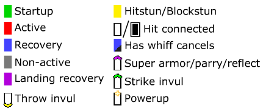

# ggxrd_hitbox_overlay_2211


## Description

Adds hitboxes overlaid on top of characters/projectiles for Guilty Gear Xrd Rev2 version 2211 (as of 12'th February 2025).  
Adds framebar and framedata display (see [Framebar](#framebar) section).
Also can freeze the game and play it frame-by-frame (with box display turned off for example) (see [Default Hotkeys](#default-hotkeys) section).  
Also can screenshot the game with transparency enabled/disabled (made with help from WorseThanYou (visit his website! <https://worsety.github.io/>)).  
Also contains position reset mod (see [Position Reset Mod](#position-reset-mod) section).  
Also contains input history mod (see [Input History Mod](#input-history-mod) section) which can display input history when observing online matches, and it can display durations of each input in the input history.  
Also it can hide the main Enter key or numpad Enter key presses from the game, or both (in General Settings).  
The mod hides its output from OBS recording, and this can be turned off in 'UI - Settings - General Settings - Dodge OBS Recording' or by going to OBS and checking the 'Capture third-party overlays (such as steam)' checkbox.

## Credits

Original version created by Altimor: <http://www.dustloop.com/forums/index.php?/forums/topic/12495-xrd-pc-hitbox-overlay-mod/>  
Created in 2016.  
This version is adapted for Guilty Gear Xrd Rev2 version 2211 with the full featureset of the original.

Many thanks to WorseThanYou (@worsety), without whose help this wouldn't have been possible.  
Thanks to @PCvolt for advice on framebar and allowing to add his labtool's (<https://github.com/PCvolt/rev2-Labtool>) functionality to this mod. Thanks to WorseThanYou (again) for help and advice on framebar.  
Thanks to Pangaea for their BBScript database (<https://github.com/super-continent/bbscript>), which is invaluable in understanding almost everything about how the game works. The people who made the database seem to have reverse engineered the entire game, it's really amazing!

## System requirements

Intel processor architecture x86 (32-bit) or x64 (64-bit) (AMD will work). Windows operating system.  
For Ubuntu/Linux you need to be running the Windows version of Guilty Gear Xrd (I'm not aware of a Linux version existing) under Steam Proton.

## Quickstart for Windows

1. Download the latest release from the `Releases` section on the right side of this page.

2. Launch the game. Or you can do the next step at any point while the game is running.

3. Go to downloaded folder and launch `ggxrd_hitbox_injector.exe`.

4. Start a match. Hitboxes should display.

Read the [Hitboxes](#hitboxes) section to understand what the colors mean.  
Read the [Default Hotkeys](#default-hotkeys) section to know what the default hotkeys are.  
You can also play the game frame-by-frame (described in [Default Hotkeys](#default-hotkeys)).

To turn off the mod you can launch `ggxrd_hitbox_injector.exe` again.

The mod may show up as a virus. I swear this is not a virus, check the source code, compile this yourself if still doubting. Check commit history of this repo. Add this to whatever antivirus exceptions necessary and run as administrator if necessary.

## Quickstart for Ubuntu/Linux

On Ubuntu/Linux the injector won't work on its own. You need to cd into the mod's directory and type into the console:

```bash
chmod u+x launch_ggxrd_hitbox_injector_linux.sh
.\launch_ggxrd_hitbox_injector_linux.sh
```

This will launch the injector (the .exe one) on the same Wine server that Guilty Gear runs on. Assuming you're running the game using Steam Proton, and its version is supported, everything should work.  
If it doesn't work, you can use the patcher:

## Patching the game to always launch with the mod

If you patch the game it will always load the DLL automatically on startup. The `ggxrd_hitbox_patcher_linux` and `ggxrd_hitbox_patcher` do exactly that (on Linux and Windows respectively) and must be launched directly, without Wine. (If on Linux the patcher doesn't start, you might need to do `chmod u+x ggxrd_hitbox_patcher`.) The patcher on Ubuntu/Linux, when it asks, must be provided the full path to the game executable (`GuiltyGearXrd.exe`) without quotes. The Windows patcher will show a file selection dialog instead.  
The patched game will now try to load the `ggxrd_hitbox_overlay.dll` on startup. In order for the game to find the DLL it must be placed in the same directory as the game executable, which should be in Steam's directory, for example: `~/.steam/debian-installation/steamapps/common/GUILTY GEAR Xrd -REVELATOR-/Binaries/Win32`, where `~` is your home directory.  
If the DLL is not found when the game launches, it will just run normally, without the mod.  
Normally you can run the injector to unload the mod, but if for whatever reason you can't run it on Linux, then there's no way to unload the mod. To solve this you can add the `.ini` file mentioned in [Hotkey configuration](#hotkey-configuration) section into the folder with the game executable and change the line `startDisabled = false` to `startDisabled = true` in it and use the `F6` (the default) hotkey to enable the mod when you need.

If Steam Proton is taking forever to launch the game, patched or not, then rename the mod's dll and put the original, unpatched version of the game executable back, then try switching the Proton version in Steam's settings and agree to restart Steam. After restarting Steam will start downloading two things related to Guilty Gear Xrd and will launch GGXrd automatically (even though you didn't tell it to). GGXrd should work. Quit GGXrd. Place the patched version of the game executable and the mod's dll back and restart GGXrd. GGXrd will launch with the mod. Idk what causes this.

## Hitboxes

### Red - Hitboxes

Strike and projectile non-throw hitboxes are shown in red. Clash-only hitboxes are shown in more transparent red with thinner outline. Hitboxes' fills may never be absent.

### Green - Hurtboxes

Normally hurtboxes display in green. The rules in general are such, that when a hitbox (red) makes contact with hurtbox, a hit occurs.  
If a hurtbox is displayed fully transparent (i.e. shows outline only), that means strike invulnerability.  
If a hurtbox is hatched with diagonal lines, that means some form of super armor is active: it could be parry (Jam 46P), projectile reflection (Zato Drunkard Shade), super armor (Potemkin Hammerfall), or projectile-only invulnerability (Ky Ride the Lightning), or direct player attacks-only invulnerability (Ky j.D). This visual hatching effect can be combined with the hurtbox being not filled in, meaning strike invulerability + super armor/other.  
For Jack O's and Bedman's summons the hurtbox's outline may be thin to create less clutter on the screen.

### Light blue - Would-be counterhit hurtboxes

If your hurtbox is displaying light blue, that means, should you get hit, you would enter counterhit state. It means that moves that have light blue hurtbox on recovery are more punishable.  
If a hurtbox is hatched with diagonal lines, that means some form of super armor is active: it could be parry (Jam 46P), projectile reflection (Zato Drunkard Shade), super armor (Potemkin Hammerfall), or projectile-only invulnerability (Ky Ride the Lightning), or direct player attacks-only invulnerability (Ky j.D).

### Gray - Pre-hit hurtboxes

When you get hit a gray outline appears on top of your current hurtbox. This outline represents the previous state of your hurtbox, before you got hit. Its purpose is to make it easier to see how or why you got hit.

### Yellow - Pushboxes

Each player has a pushbox. When two pushboxes collide, the players get pushed apart until their pushboxes no longer collide. Pushbox widths also affect throw range - more on that in next section(s).  
If a pushbox is displayed fully transparent (i.e. shows outline only), that means throw invulnerability.  
Pushbox outline is always thin.

### Point/Cross - Origin points

Each player has an origin point which is shown as a black-white cross on the ground between their feet. When players jump, the origin point tracks their location. Origin points play a key role in throw hit detection.

### Small black & white dot - Projectile origin points

Projectiles whose origin points were deemed to be important enough to be shown will display them as black and white tiny square points. They visualize the projectiles' position which may be used in some range or interaction checks.  

Player center of body or other point. These points may be important in some kind of interactions, but they're not the origin point, and to distinguish that they're drawn using the style of projectile origin points so that they look smaller and less important.

### Blue - Rejection boxes

When a Blitz Shield meets a projectile it displays a square blue box around the rejecting player, and if the opponent's origin point is within that box the opponent enters rejected state. The box does not show when rejecting normal, melee attacks because those cause rejection no matter the distance. Pushboxes and their sizes do not affect the distance check in any way, i.e. only the X and Y distances between the players' origin points are checked.

### Blue - Throw box pushbox check (when drawPushboxCheckSeparately = true - the default)

When a player does a throw he displays a throw box which may either be represented as one blue box, one purple box or one blue and one purple box. Throw boxes are usually only active for one frame (that's when they display semi-transparent). This period is so brief throw boxes have to show for a few extra frames, but during those frames they're no longer active and so they display fully transparent (outline only).

The blue part of the box shows the pushbox-checking throw box. It is never limited vertically, because it only checks the horizontal distance between pushboxes. The rule is if this blue throw box touches the yellow pushbox of the opponent, the pushbox-checking part of the throw is satisfied.  
But there may be another part of the throw that checks the X and/or Y of the opponent's origin point (shown in purple). If such a part of the throw box is present, it must also be satisfied, or else the throw won't connect.

This mode of showing throw boxes shows them like this:


### Purple - Throw box origin point check (when drawPushboxCheckSeparately = true - the default)

The purple part of the throw box displays the region where the opponent's origin point must be in order for this part of the throw check to connect.  
If there's a pushbox-proximity-checking part of the throw (blue), then satisfying the origin point check (purple) is not enough - the pushbox check must be passed as well. The pushbox-checking part of the throw displays in blue and is described in the section above.

### Blue - Throw boxes (when drawPushboxCheckSeparately = false)

There's an alternative mode in the mod to show the part of the throw box that checks pushbox proximity (blue) and the part of the throw box that checks the X and Y of the opponent's origin point (purple) as a single blue throw box which only checks the opponent's origin point. To turn this mode on place the `.ini` file described in [Hotkey configuration](#hotkey-configuration) into the folder with the game executable and change `drawPushboxCheckSeparately = true` to be `drawPushboxCheckSeparately = false`. (Reloading the mod is unnecessary.)

In this mode, when a player does a throw he displays a throw box in blue color. Throw boxes are usually only active for one frame (that's when they display semi-transparent). This period is so brief throw boxes have to show for a few extra frames, but during those frames they're no longer active and so they display fully transparent (outline only).

In this mode, throw boxes must only include the opponent's origin point in order to connect (but that's not all, read on). That means that the sizes of your and your opponent's pushboxes affect the width of your throw box. Try crouching and see how your pushbox becomes wider a bit. This means crouching opponents are slightly easier to throw. Or Potemkin - he has a wider pushbox than average.

It's in the rules of the game that ground throws may only connect with non-airborne opponents and air throws may only connect with airborne opponents. Opponents who are in prejump state cannot be ground thrown.  
Most normal ground throws and ground command throws for this reason do not limit their throw boxes vertically: the throw box shows as a pillar reaching vertically over the entire screen's height. This doesn't mean they capture anything above or below the thrower, though, and the rules mentioned above are still being obeyed.

Some throws check for vertical position of the opponent's origin point and so display their throw box limited in size vertically.  
When visually checking to see if a throw box would connect with an opponent you should, in this mod, ignore the pushboxes altogether and focus only on the throw box catching the origin point.  
Note that normal ground throw actually simply checks if distance between the pushboxes is below the attacker's throw range (values listed on Dustloop), however some throws like command throws or air throws also check if the origin point specifically is within x or y range. Hence this is why this mode exists to just always show the check on the origin point only.

This mode of showing throw boxes shows them like this:


### White - Interaction boxes/circles

Boxes or circles like this are displayed when a move is checking ranges. They may be checking distance to a player's origin point or to their 'center', depending on the type of move or projectile. All types of displayed interactions will be listed here down below.

- Ky Stun Edge, Charged Stun Edge and Sacred Edge: The box shows the area in which Ciel's origin point must be in order for the projectile to become Fortified.

- May Beach Ball: The circle shows the range in which May's center of body must be in order to jump on the ball. May's center of body is additionally displayed as a smaller point, instead of like a cross, like her origin point. Now, this may be a bit much, but a white line is also displayed connecting May's center of body point to the ball's point that is at the center of the circle. This line serves no purpose other than to remind the user that the range check of the circle is done against the center of body point of May, not her origin point. The display of all this needs to be enabled with dontShowMayInteractionChecks setting ('Settings - Hitboxes - Don't Show May Interaction Checks' in mod's UI).

- May Dolphin: The circle shows the range in which May's behind the body point must be in order to ride the Dolphin. The point behind May's body depends on May's facing, and not the Dolphin's. Additionally, a line connecting May's behind the body point and the origin point of the Dolphin is shown. It serves no purpose other than to remind the user that the distance check is performed against May's behind the body point, and not her origin point. The display of all this needs to be enabled with dontShowMayInteractionChecks setting ('Settings - Hitboxes - Don't Show May Interaction Checks' in mod's UI).

- Millia Pin: The infinite vertical box shows the range in which Millia's origin point must be in order for the Pin to be picked up. Millia must be in either of the following animations:
  - Stand to Crouch
  - Crouch
  - Crouch Turn (as of Rev2)
  - Roll (as of Rev2)
  - Doubleroll (as of Rev2)
  
- Millia Bad Moon Buff Height: The infinite horizontal line shows the height above which Millia's origin point must be in order for Bad Moon to get some attack powerup. However, Bad Moon is limited by the maximum number of hits it can deal, which increases with height (the buff height is 500000, next buffs are at 650000, 800000, 950000, 1100000, 1250000, 1400000). The display of the height line must be enabled with showMilliaBadMoonBuffHeight setting ('UI - Character specific - Show Millia Bad Moon Buff Height (Rev2 only)').
  
- Faust Food Items: The white box shows where a player's origin point must be in order to pick up the food item.
  
- Faust Helium: The circle shows the range in which opponent's or Faust's origin point must be in order to pick up the Helium.
  
- Faust 5D: The inner circle shows the range in which the thrown item's origin point must be in order to achieve a homerun hit. The outer circles shows the range in which the thrown item's origin point must be in order to achieve a non-homerun hit. This display needs to be enabled with showFaustOwnFlickRanges setting ('UI - Character specific - Show Faust Own Projectile Flick Ranges'). The circle is displayed for more than one frame, but it is filled in on only one. The frame when it is filled in is when it is active, and the other frames are just for visual clarity, so you could have enough time to actually see the circle.

- Bedman Task C Height Buff: The infinite horizontal line shows the height above which Bedman's origin point must be in order for Task C to gain a powerup that makes it slam the ground harder. That height is 700000. The display of the height line must be enabled with showBedmanTaskCHeightBuffY INI setting (located in UI in Character Specific - Show Bedman Height Buff Y).

- Ramlethal Sword Re-Deploy No-Teleport Distance: The infinite vertical boxes around the swords show the distance in which the opponent's origin point must be in order for the sword to not spend extra time teleporting to the opponent when you re-deploy it.

- Sin Hawk Baker Red Hit Box: The line connecting Sin to the wall that he's facing has a marking on it denoting the maximum distance he must be from the wall, as one of two possible ways to get a red hit. The distance marker checks for Sin's origin point, not his pushbox. If Sin is too far from the wall that he is facing, the other way to get a red hit is for the opponent's origin point to be close to Sin, inside the infinite white vertical box drawn around him. If Sin is neither close to the wall he's facing nor close enough to the opponent, the hit is blue.

- Elphelt Max Charge Shotgun: If the opponent's origin point is within the infinite white vertical box around Elphelt, then the shotgun shot gets the maximum possible powerup.

- Johnny Bacchus Sigh: If the opponent's center of body (marked with an extra small point) is within the circle, Bacchus Sigh will connect on the next frame.

- Jack-O' Ghost Pickup Range: The displayed vertical box around each Ghost (house) shows the range in which Jack-O's origin point must be in order to pick up the Ghost or gain Tension from it. This is only displayed when the 'showJackoGhostPickupRange' setting in the INI is on (in UI it's located at main mod's UI - Character Specific - Show Jack-O' Ghost Pickup Range).

- Jack-O' Aegis Field Range: The white circle shows the range where the Ghosts' or Servants' origin points must be in order for them to receive protection of the Field. This display must be enabled with the 'showJackoAegisFieldRange' setting in the INI file (located in mod's UI - Character Specific - Show Jack-O' Aegis Field Range).

- Jack-O' Servant Attack Range: The white box around each Servant shows the area where the opponent's player's origin point must be in order for the Servant to initiate an attack. This display must be enabled with the 'showJackoServantAttackRange' setting in the INI file (located in mod's UI - Character Specific - Show Jack-O' Servant Attack Range).

- Jam Bao Saishinshou: The white box shows the vertical range where the opponent's origin point be upon the hit connecting in order to be vacuumed by the attack.

- Haehyun Enlightened 3000 Palm Strike: The giant circle shows where the opponent's center of body point has to be in order to be vacuumed. The center of body points of both players are shown and a line connecting them is shown as a guide for what exact distance is being measured by the game.

- Baiken Metsudo Kushodo: The white box shows the area where opponent's origin point must be at the moment the move is performed, in order for Baiken to shoot out ropes and travel to the opposite wall.

- Answer Scroll: The white box around the scroll shows the area where Answer's origin point must be in order to cling to the scroll. After entering the area, you are able to cling only on the frame after the next one. So Enter range -> Wait -> Cling.

- Answer Card: The infinite vertical white box around the card shows the area where the opponent's origin point must be in order for the Clone to track to their position.

- Leo bt.D successful parry: The white box around Leo shows where the origin point of the opponent must be in order to get vaccuumed.

- Baiken Tsurane Sanzu-watashi: The white box in front of Baiken shows where the origin point of the opponent must be at the moment of the second hit in order to trigger the secondary super cinematic. An extra condition for the cinematic to be triggered is also that the first hit of the super connected, but the distance on it is not checked.

### Outlines lie within their boxes/on the edge

If a box's outline is thick, it lies within that box's bounds, meaning that two boxes intersect if either their fills or outlines touch or both. This is relevant for throwboxes too.  
If a box's outline is thin, like that of a pushbox or a clash-only hitbox for example, then that outline lies on the edge of the box. For Jack O's and Bedman's summons the hurtbox's outline may be thin to create less clutter on the screen.

### General notes about throw boxes

If a move has a throw box as well as hitbox - both the hitbox and the throw boxes must connect. By the way, Potemkin Buster's hitbox does not matter - only the throw box (proof: <https://youtu.be/59uc9h6KKIE>).

Answer's and I-No's air command grabs cannot grab behind them.

## Default Hotkeys

### Frame-by-frame animation playback

You can force the game to play one frame at a time (in training mode only). Read on in [F3 - Freeze game](#f3---freeze-game) section and sections after that.

### F1 - GIF mode

In training mode (only) you can press F1 to enter "GIF mode", which makes the background black, centers the camera on you, hides all of the HUD and makes opponent invisible and unhittable.  
Press the key again to turn off the mode.  
GIF mode can be broken down into separate toggles for each of its functionalities.  
Section [Hotkey configuration](#hotkey-configuration) describes how to configure hotkeys.

### F2 - No gravity mode

In training mode (only) you can press F2 to enter "No gravity mode" which makes your vertical speed always 0, i.e. you become unable to fall. This may be useful for screenshotting some air moves.  
Press the key again to turn off the mode.  
Section [Hotkey configuration](#hotkey-configuration) describes how to configure hotkeys.

### F3 - Freeze game

Freezes the game and stops animations and game logic from advancing.  
Section [Hotkey configuration](#hotkey-configuration) describes how to configure hotkeys.

### F4 - Slow-motion mode

Plays the game at 3 times (the default) slower rate. You configure the rate in settings (read on in `Hotkey configuration`), but the `slowmoTimes` must be a whole, round number greater than 1. I.e. the game can only be slowed down 2, 3, 4, etc times.  
Section [Hotkey configuration](#hotkey-configuration) describes how to configure hotkeys.

### F5 - Advance to next frame

While the game is frozen using `Freeze game` feature, advances the game forward by 1 frame. Does nothing if the game is not currently frozen.  
Section [Hotkey configuration](#hotkey-configuration) describes how to configure hotkeys.

### F6 - Disable mod

This toggle enables/disables the mod if you don't want to (or can't) load/unload it every time.  
There's also a setting named `startDisabled = false/true` which is a boolean which tells the mod to either be disabled or enabled right when it starts, so that you could start the game with the mod disabled initially.

### F7 - Toggle hitboxes display

Since the `Disable mod` toggle disables the whole mod, this toggle only disables the hitbox drawing, so that GIF mode, No gravity mode, freeze game mode, etc may still work, only the boxes don't display.

### F8 - Take transparent/non-transparent screenshot

This is a big section that is described in [Taking transparent/non-transparent screenshots](#taking-transparentnon-transparent-screenshots) section. Basically this is a button to take a screenshot of the game with transparency enabled/disabled. Transparency only works under conditions described in that section.

### ESC - Show/hide mod's UI

By default when you start the mod it will open a UI window in-game that has all the controls and settings laid out as buttons, checkboxes and fields. To hide the UI you can close it by clicking the x in the top right corner or by pressing ESC (default hotkey). To open the UI again, press ESC (default hotkey). You configure this hotkey and whether the UI opens when you start the mod using `modWindowVisibilityToggle` (in the mod's UI it's under 'Settings - Keyboard Shortcuts - Hide UI Toggle') and `modWindowVisibleOnStart` (in the mod's UI it's under 'Settings - General Settings - Mod Window Visible On Start').

### Hotkey configuration

If you wish to configure hotkeys for Gif mode and No gravity mode and other modes, you can use the mod's UI that you can see in the game's window when you load the mod. All other settings are also located in various parts of the UI. Or you can configure all settings by creating a text file named `ggxrd_hitbox_overlay.ini` and placing it in the directory where the game executable is. For example, for me my Steam version of the game is located at `...\SteamLibrary\steamapps\common\GUILTY GEAR Xrd -REVELATOR-\Binaries\Win32`.  
Here's an example of the `.ini` file:

<details>
  <summary>Here's an example of the `.ini` file:</summary>

```ini
; Place this file into the game folder containing 'GuiltyGearXrd.exe' so that it gets seen by the mod. Allowed key names: Backspace, Tab, Enter, PauseBreak, CapsLock, Escape, Space, PageUp, PageDown, End, Home, Left, Up, Right, Down, PrintScreen, Insert, Delete, Num0, Num1, Num2, Num3, Num4, Num5, Num6, Num7, Num8, Num9, NumMultiply, NumAdd, NumSubtract, NumDecimal, NumDivide, F1, F2, F3, F4, F5, F6, F7, F8, F9, F10, F11, F12, NumLock, ScrollLock, Colon, Plus, Minus, Comma, Period, Slash, Tilde, OpenSquareBracket, Backslash, CloseSquareBracket, Quote, Backslash2, 0123456789, ABCDEFGHIJKLMNOPQRSTUVWXYZ, Shift, Ctrl, Alt, JoystickBtn1, JoystickBtn2, JoystickBtn3, JoystickBtn4, JoystickLeftTrigger, JoystickRightTrigger, JoystickLeftTrigger2, JoystickRightTrigger2, JoystickBtn9, JoystickBtn10, JoystickBtn11, JoystickBtn12, JoystickBtn13, JoystickBtn14, JoystickBtn15, JoystickBtn16, LeftStickLeft, LeftStickUp, LeftStickRight, LeftStickDown, DPadLeft, DPadUp, DPadRight, DPadDown, PS4DualshockRightStickLeft, PS4DualshockRightStickUp, PS4DualshockRightStickRight, PS4DualshockRightStickDown, XboxTypeSRightStickLeft, XboxTypeSRightStickUp, XboxTypeSRightStickRight, XboxTypeSRightStickDown.

; Key combinations can be specified by separating key names with '+' sign.
; You can assign same key to multiple features - it will toggle/set in motion all of them simultaneously.
; You don't need to reload the mod when you change this file - it re-reads this settings file automatically when it changes.

; All of these settings can be changed using the mod's UI which can be seen in the game if you press ESC (by default, see modWindowVisibilityToggle).

; A keyboard shortcut to toggle GIF mode.
; GIF mode is:
; 1) Background becomes black
; 2) Camera is centered on you
; 3) Opponent is invisible and invulnerable
; 4) Hide HUD
gifModeToggle =

; A keyboard shortcut to only toggle the "background becomes black" part of the gifModeToggle.
; Empty by default, which means no hotkey is assigned. Assign your desired hotkey manually here.
; This option can be combined with the other "only" options, by sharing the same key binding for example
gifModeToggleBackgroundOnly =

; A keyboard shortcut to toggle the game's Settings - Display Settings - Post-Effect. Changing it this way does not
; require the current match to be restarted.
; Alternatively, you could set the turnOffPostEffectWhenMakingBackgroundBlack setting in this INI file to true
; so that whenever you enter either the GIF mode or the GIF mode (black background only), the Post-Effect is
; turned off automatically, and when you leave those modes, it gets turned back on.
; This hotkey is empty by default, which means no hotkey is assigned. Assign your desired hotkey manually here.
; This option can be combined with the other hotkey options, by sharing the same key binding for example.
togglePostEffectOnOff =

; Specify true or false.
; When true, whenever you enter either the GIF mode or the GIF mode (black background only),
; the Post-Effect is turned off automatically, and when you leave those modes, it gets turned back on.
turnOffPostEffectWhenMakingBackgroundBlack = true

; Specify true or false.
; When entering a camera-center mode using "gifModeToggle", "gifModeToggleCameraCenterOnly" or "toggleCameraCenterOpponent",
; which center the camera on either you or the opponent, the camera is angled downwards slightly, and this camera angle is called "pitch".
; It may cause lines of hitboxes to not be displayed entirely parallel to the sides of the screen.
; By setting this to true you can force the camera to look straight forward.
forceZeroPitchDuringCameraCentering = true

; Specify a floating point value where '.' is the delimiter, like so: 0.0
; When entering a camera-center mode using "gifModeToggle", "gifModeToggleCameraCenterOnly" or "toggleCameraCenterOpponent",
; which center the camera on either you or the opponent, this value will control how offset the camera is horizontally, relative
; to the player. A positive value offsets left, and a negative offsets right. Default value is 0.0.
cameraCenterOffsetX = 0.0

; Specify a floating point value where '.' is the delimiter, like so: 106.4231
; When entering a camera-center mode using "gifModeToggle", "gifModeToggleCameraCenterOnly" or "toggleCameraCenterOpponent",
; which center the camera on either you or the opponent, this value will control how offset the camera is vertically, relative
; to the player. A positive value offsets down, and a negative offsets up. Default value is 106.4231.
cameraCenterOffsetY = 106.4231

; Specify a floating point value where '.' is the delimiter, like so: 130.4231
; When entering a camera-center mode using "gifModeToggle", "gifModeToggleCameraCenterOnly" or "toggleCameraCenterOpponent",
; which center the camera on either you or the opponent, AND "forceZeroPitchDuringCameraCentering" is set to true,
; this value will control how offset the camera is vertically, relative
; to the player. A positive value offsets down, and a negative offsets up. Default value is 130.4231.
cameraCenterOffsetY_WhenForcePitch0 = 130.4231

; Specify a floating point value where '.' is the delimiter, like so: 540.0
; When entering a camera-center mode using "gifModeToggle", "gifModeToggleCameraCenterOnly" or "toggleCameraCenterOpponent",
; which center the camera on either you or the opponent,
; this value will control how far the camera is. The bigger the value, the further the camera will be. Default value is 540.0.
cameraCenterOffsetZ = 540.0

; A keyboard shortcut to only toggle the "Camera is centered on you" part of the gifModeToggle.
; Empty by default, which means no hotkey is assigned. Assign your desired hotkey manually here.
; This option can be combined with the other "only" options, by sharing the same key binding for example
gifModeToggleCameraCenterOnly =

; A keyboard shortcut to toggle the camera to be centered on the opponent.
; Empty by default, which means no hotkey is assigned. Assign your desired hotkey manually here.
; This option can be combined with GIF Mode options, by sharing the same key binding for example
toggleCameraCenterOpponent =

; A keyboard shortcut to only toggle the "Opponent is invisible and invulnerable" part of the gifModeToggle.
; Empty by default, which means no hotkey is assigned. Assign your desired hotkey manually here.
; This option can be combined with the other "only" options, by sharing the same key binding for example
gifModeToggleHideOpponentOnly =

; A keyboard shortcut to toggle hiding the player.
; Empty by default, which means no hotkey is assigned. Assign your desired hotkey manually here.
; This option can be combined with GIF Mode options, by sharing the same key binding for example
toggleHidePlayer =

; A keyboard shortcut to only toggle the "hide hud" part of the gifModeToggle.
; Empty by default, which means no hotkey is assigned. Assign your desired hotkey manually here.
; This option can be combined with the other "only" options, by sharing the same key binding for example
gifModeToggleHudOnly =

; A keyboard shortcut to toggle No gravity mode
; No gravity mode is you can't fall basically
noGravityToggle = F2

; A keyboard shortcut to freeze the game
freezeGameToggle = F3

; A keyboard shortcut to play the game in slow motion.
; Please specify by how many times to slow the game down in "slowmoTimes"
slowmoGameToggle = F4

; A keyboard shortcut. Only works while the game is frozen using freezeGameToggle.
; Advances the game forward one frame
allowNextFrameKeyCombo = F5

; A number.
; This works in conjunction with slowmoGameToggle. Only round numbers greater than 1 allowed.
; Specifies by how many times to slow the game down
slowmoTimes = 3

; A keyboard shortcut to enable/disable the mod without having to load/unload it
disableModToggle = F6

; Specify true or false.
; When true, starts the mod in a disabled state: it doesn't draw boxes or affect anything
startDisabled = false

; A keyboard shortcut to enable/disable only the mod hitbox drawing feature:
; the GIF mode and no gravity, etc will keep working
disableHitboxDisplayToggle = F7

; A keyboard shortcut.
; Takes a screenshot and saves it at screenshotPath path
; To take screenshots over a transparent background you need to go to the game's
; Display Settings and turn off Post-Effect (or use togglePostEffectOnOff and
; turnOffPostEffectWhenMakingBackgroundBlack settings for this), then use GIF mode (make background dark).
; Then screenshots will film character over transparent background.
; If the dontUseScreenshotTransparency setting is true, screenshot will be without
; transparency anyway
screenshotBtn = F8

; A path to a file or a directory.
; It specifies where screenshots will be saved.
; If you provided a file path, it must be with .png extension, and if such name already exists, a
; number will be appended to it, increasing from 1 to infinity consecutively so that it's unique,
; so that new screenshots will never overwrite old ones.
; If you provided a directory path, it must already exist, and "screen.png" will be appended to
; it with an increasing number at the end in case the filename is not unique.
; The provided path must be without quotes.
; If you want the path to be multilingual you need to save this file in UTF-8.
; On Ubuntu/Linux running Guilty Gear Xrd under Steam Proton you need to specify paths with
; the Z:\ drive, path separator is backslash (\), not forward slash (/). Example: Z:\home\yourUserName\ggscreen.png
; If the path is not specified or is empty, the screenshot will be saved into your clipboard so
; it can be pasted into any image editing program. For example, GIMP will recognize the PNG
; format and paste that, with transparency. This would work even on Ubuntu/Linux.
; Only PNG format is supported.
screenshotPath = ;C:\Users\yourUser\Desktop\test screenshot name.png   don't forget to uncomment (; is a comment)

; Specify true or false.
; When this setting is on, screenshots get saved to clipboard only, even if a screenshot path is specified.
ignoreScreenshotPathAndSaveToClipboard = false

; Specify true or false.
; When this is true that means screenshots are being taken every game loop logical frame as
; long as the screenshotBtn is being held. Game loop logical frame means that if the game is
; paused or the actual animations are not playing for whatever reason, screenshot won't be taken.
; A new screenshot is only taken when animation frames change on the player characters.
; Be cautions not to run out of disk space if you're low. This option doesn't
; work if screenshotPath is empty, it's not allowed to work outside of training mode or when
; a match (training session) isn't currently running (for example on character selection screen).
allowContinuousScreenshotting = false

; A keyboard shortcut.
; This toggle can be used same way as screenshotBtn (when it's combined with
; allowContinuousScreenshotting = true), except it's a separate key combination and when you
; press it, it toggles the continuous screenshot taking every game logical frame. This
; toggle does not require allowContinuousScreenshotting to be set to true,
; or screenshotBtn to be set to anything.
continuousScreenshotToggle =

; Specify true or false.
; Setting this to true will produce screenshots without transparency
dontUseScreenshotTransparency = false

; Specify true or false.
; Setting this to true will make throw boxes show in an opponent-character-independent way:
; The part of the throw box that checks for pushboxes proximity will be shown in blue,
; while the part of the throw box that checks x or y of the origin point will be shown in purple
; Setting this to false will combine both the checks of the throw so that you only see the final box
; in blue which only checks the opponent's origin point. Be warned, such a throw box
; is affected by the width of the opponent's pushbox. Say, on Potemkin, for example,
; all ground throw ranges should be higher.
drawPushboxCheckSeparately = true

; Specify true or false.
; Setting this to true may increase the performance of transparent screenshotting which may be useful if you're screenshotting every frame.
; The produced screenshots won't have such improvements as improving visibility of semi-transparent effects or changing hitbox outlines to
; black when drawn over the same color.
useSimplePixelBlender = false

; A keyboard shortcut.
; Pressing this shortcut will show/hide the mod's UI window.
modWindowVisibilityToggle = Escape

; Specify true or false.
; If this is false, when this mod starts, the mod's UI window will be invisible.
modWindowVisibleOnStart = true

; A keyboard shortcut.
; Pressing this shortcut will disable/enable the display of residual hurtboxes that appear on hit/block and show
; the defender's hurtbox at the moment of impact. These hurtboxes display for only a brief time on impacts but
; they can get in the way when trying to do certain stuff such as take screenshots of hurtboxes.
toggleDisableGrayHurtboxes = 

; A keyboard shortcut.
; Pressing this shortcut will disable/enable the "neverIgnoreHitstop" setting which controls whether
; the framebar advances during hitstop.
toggleNeverIgnoreHitstop = 

; A keyboard shortcut.
; Pressing this shortcut will disable the input history shown via "displayInputHistoryWhenObserving"
; and "displayInputHistoryInSomeOfflineModes". It only works when one of those settings is enabled
; and is showing history in corresponding game mode.
toggleShowInputHistory = 

; Specify true or false.
; This disables the display of gray hurtboxes (for a toggle see toggleDisableGrayHurtboxes).
; Gray hurtboxes are residual hurtboxes that appear on hit/block and show the defender's hurtbox at the moment of impact.
; These hurtboxes display for only a brief time on impacts but they can get in the way when trying to do certain stuff such
; as take screenshots of hurtboxes on hit/block.
neverDisplayGrayHurtboxes = false

; Specify true or false.
; Setting this to true will hide all hurtboxes, hitboxes, pushboxes and other boxes and points.
dontShowBoxes = false

; Specify true or false.
; Display mod's UI on top of the game's Pause Menu. This setting has no effect when "dodgeObsRecording" is true and
; an OBS is connected to the game.
displayUIOnTopOfPauseMenu = true

; Specify true or false.
; To have this mod avoid OBS capture set this setting to true and also make sure
; that in OBS, in Sources you selected your Source, clicked Cogwheel and unchecked the
; 'Capture third-party overlays (such as steam)'.
; I am very sorry, but the mod's UI, the framebar and the boxes cannot be drawn under the game's
; Pause Menu and game's own UI while using 'Dodge OBS Recording'.
dodgeObsRecording = true

; Specify a whole number.
; In the UI's 'Invul' field and in the framebar on-mouse-hover info,
; hurtboxes that are below this Y will trigger the display of 'low profile' invulnerability type.
; After changing this value, redo the move to see the updated value.
lowProfileCutoffPoint = 175000

; Specify true or false.
; This setting can be changed using the framebarVisibilityToggle hotkey.
; If closingModWindowAlsoHidesFramebar is true, then setting showFramebar to true is not enough, as the main
; mod's UI window must also be open in order to show the framebar. If the window is not open, and showFramebar is true,
; then the only way to open it and to show the framebar is with the modWindowVisibilityToggle hotkey.
showFramebar = true

; Specify true or false.
; If false, the framebar will not be shown when in training mode even when showFramebar is true and the UI is open.
showFramebarInTrainingMode = true

; Specify true or false.
; If false, the framebar will not be shown when in replay mode even when showFramebar is true and the UI is open.
showFramebarInReplayMode = true

; Specify true or false.
; If false, the framebar will not be shown when in other modes even when showFramebar is true and the UI is open.
showFramebarInOtherModes = false

; Specify true or false.
; If this is true, then closing the main mod's window, either using a hotkey or the cross mark,
; will also hide the framebar, while opening the main mod's window will show the framebar.
; Alternatively you could set up a separate hotkey to control visibility of the framebar, using "framebarVisibilityToggle".
; Note that even when the UI is open, "showFramebar" must be set to true for the framebar to be visible.
closingModWindowAlsoHidesFramebar = true

; Specify true or false.
; In the main UI window, there's a field called 'Move' which displays the last performed move or several moves
; that the mod decided to combine together. That text can get pretty long. If you set this setting to true,
; then that field will be hidden, and you will only be able to see moves' names either in 'Cancels (P1/P2)' window,
; or by hovering your mouse over the 'Startup' or 'Total' fields in the main UI window and reading their tooltip.
dontShowMoveName = false

; Specify true or false.
; Setting this to true will modify the RISC gauge so that the middle represents 0 RISC and no combo proration,
; the right half represents RISC, and the left half represents combo proration.
showComboProrationInRiscGauge = false

; Specify true or false.
; Setting this to true will display both players' input history when observing online matches.
displayInputHistoryWhenObserving = true

; Specify true or false.
; Setting this to true will display both players' input history when playing against CPU in Episode/Story, offline Versus,
; Tutorial, offline MOM and Mission.
displayInputHistoryInSomeOfflineModes = false

; Specify true or false.
; Setting this to true will display the duration of each input, in frames, in the input history.
showDurationsInInputHistory = false

; Specify true or false.
; Setting this to true will override the game's default behavior of position reset (stage reset) in offline Training Mode.
; 2+Reset: non-swapped roundstart position;
; 8+Reset: swapped roundstart position;
; 4+Reset: left corner. Human Player outside the corner, CPU inside;
; 1+Reset: left corner. Human Player inside the corner, CPU outside;
; 6+Reset: right corner. Human Player outside the corner, CPU inside;
; 3+Reset: right corner. Human Player inside the corner, CPU outside;
; 5+Reset: reset to last used position;
; 9+Reset: set current arbitrary position of both players as 'last used position'.
; You can use the "positionResetDistBetweenPlayers" and "positionResetDistFromCorner" settings to tweak
; the default positions in the corner.
usePositionResetMod = false

; A number.
; Specifies the distance between the two players, not divided by 100, when resetting position into the corner.
; This setting is only used when "usePositionResetMod" setting is enabled.
; The default value of this field is 105000.
positionResetDistBetweenPlayers = 105000

; A number.
; Specifies the distance of the player closest to the corner, from said corner, not divided by 100,
; when resetting position into the corner.
; This setting is only used when "usePositionResetMod" setting is enabled.
; The default value of this field is 0.
positionResetDistFromCorner = 0

; Specify true or false.
; Setting this to true will display Progress differently in Stun/Stagger Mash window.
; Instead of displaying it as Mashed + Animation Duration / Stagger Duration - 4, it will
; display as Animation Duration / Stagger Duration - 4 - Mashed
useAlternativeStaggerMashProgressDisplay = false

; Specify true or false.
; When a May P or K Ball is on the screen, a circle is drawn around it, an extra point is displayed on the Ball,
; and, when May is airborne, an extra point is displayed in the center of body of May, and a line connecting that
; point to the extra point on the Ball is displayed.
; When this setting is true, none of this is displayed.
dontShowMayInteractionChecks = true

; Specify true or false.
; When this setting is on, and one of the character is Millia, a horizontal line is displayed high above the arena,
; showing the height on which Millia's Bad Moon obtains some kind of attack powerup.
; Millia's origin point must be above the line in order to gain the powerup.
showMilliaBadMoonBuffHeight = false

; Specify true or false.
; When this setting is on, when Faust does a 5D, two ranges are shown around his flickpoint,
; denoting ranges in which his thrown items' origin points must be to get either hit or homerun hit.
showFaustOwnFlickRanges = true

; Specify true or false.
; When this setting is on, a horizontal line is constantly shown on the screen at the height above which
; Bedman's Task C gains a buff.
; This line is so high you can't see it unless you jump.
showBedmanTaskCHeightBuffY = false

; Specify true or false.
; When this setting is on, an infinite vertical box around each Ghost (house) denotes the range in which
; Jack-O's origin point must be in order to pick up the Ghost or gain Tension from it.
showJackoGhostPickupRange = false

; Specify true or false.
; When this setting is on, yellow pushboxes are drawn around the Servants and the Ghosts, similar to how they're drawn
; around the players.
showJackoSummonsPushboxes = false

; Specify true or false.
; When this setting is on, the white circle around Jack-O' shows the range where the Servants' and the Ghosts'
; origin point must be in order to receive protection from Aegis Field.
showJackoAegisFieldRange = false

; Specify true or false.
; When this setting is on, the white box around each Servant shows the area where the opponent's player's
; origin point must be in order for the Servant to initiate an attack.
showJackoServantAttackRange = false

; A keyboard shortcut.
; Pressing this shortcut will show/hide the framebar window by changing the showFramebar setting.
; If closingModWindowAlsoHidesFramebar is true, then setting showFramebar to true is not enough, as the main
; mod's UI window must also be open in order to show the framebar. If the window is not open, and showFramebar is true,
; then the only way to open it and to show the framebar is with the modWindowVisibilityToggle hotkey.
framebarVisibilityToggle = 

; Specify true or false.
; Strike invul will be displayed using a green ^ on top of a frame.
showStrikeInvulOnFramebar = true

; Specify true or false.
; Super armor will be displayed using a purple ^ on top of a frame. It includes reflect, parry and projectile-only invulnerability
; (excluding Aegis Field, that isn't displayed on the framebar at all). If both strike invul and super armor are present, super armor
; will be below the strike invul.
showSuperArmorOnFramebar = true

; Specify true or false.
; Throw invul will be displayed using a yellow v underneath a frame.
showThrowInvulOnFramebar = true

; Specify true or false.
; OTG state will be displayed using a gray v underneath a frame.
showOTGOnFramebar = true

; Specify true or false.
; When a player's animation changes from one to another, except in certain cases, the first frame of the new animation is denoted with
; a ' mark before that frame. For some animations a first frame is denoted even when
; the animation didn't change, but instead reached some important point. This includes entering hitstop.
showFirstFramesOnFramebar = true

; Specify true or false.
; This affects the frame counts that are displayed on the framebar. If true, the frame counter will not reset
; between different frame graphics that all mean recovery or all mean startup and so on. Idle frames are not
; affected by this and for them you should use the "considerSimilarIdleFramesSameForFrameCounts" setting.
considerSimilarFrameTypesSameForFrameCounts = true

; Specify true or false.
; This affects the frame counts that are displayed on the framebar. If true, the frame counter will not reset
; between different frame graphics that all mean idle.
considerSimilarIdleFramesSameForFrameCounts = false

; Specify true or false.
; When true, two or more projectile framebars will be combined into one if their active/non-active frames don't intersect.
combineProjectileFramebarsWhenPossible = true

; Specify true or false.
; When true, projectiles will never be combined even if there are very many of them and they're all same.
eachProjectileOnSeparateFramebar = false

; Specify true or false.
; When true, the framebar won't be cleared when resetting the stage with Record+Playback or Backspace or Pause Menu - Reset Position in Training Mode,
; or when a player dies or when a new rounds starts.
dontClearFramebarOnStageReset = false

; Specify true or false.
; Each framebar displays a label or title either to the left or to the right from it. The titles are truncated to 12 character by default.
; By setting this setting to true, you can stop them from truncating and always display full titles.
dontTruncateFramebarTitles = false

; Specify true or false.
; Each framebar displays a label or title either to the left or to the right from it.
; When the title is too long, depending on the setting, it gets cut off. Setting this to true changes some
; projectile titles to slang names to make framebar titles short so that they fit.
; This also changes names of moves that are displayed in main UI window and other windows.
useSlangNames = false

; Specify true or false.
; Each framebar displays a label or title either to the left or to the right from it, depending on which player it belongs to.
; By setting this setting to true, you can make all framebar titles always display on the left.
; To help tell which player it is you can use the "showPlayerInFramebarTitle" setting.
allFramebarTitlesDisplayToTheLeft = true

; A number.
; Specifies the height of a single framebar of one player, in pixels, including the black outlines on the outside.
; The standard height is 19.
framebarHeight = 19

; A number.
; Specifies the maximum number of characters that can be displayed in a framebar title.
; This does not include the "P1 " and "P2 " additional text that is displayed when "showPlayerInFramebarTitle" is true.
; You can use "useSlangNames" to help reduce the lengths of text displayed in framebar titles.
; The standard value is 12.
framebarTitleCharsMax = 12

; A number.
; Specifies the maximum number of frames that will be displayed on the screen at a time.
; If there're more frames stored (see "framebarStoredFramesCount") in the framebar than this number,
; a horizontal scrollbar will be displayed.
; This value can't be more than 200.
; The standard value is 80.
framebarDisplayedFramesCount = 80

; A number.
; Specifies the maximum number of past frames that can be viewed by scrolling the framebar horizontally,
; including frames that are visible without having to scroll.
; This value can't be more than 200.
; The standard value is 200.
framebarStoredFramesCount = 200

; Specify true or false.
; This setting will affect how the 'Frame Advantage' field in the UI is calculated.
; Normally, attacks put your opponent in blockstun right away, however, there are some moves that
; may put your opponent in blockstun after the move is over. Such moves are usually projectiles, such
; Ky j.D or I-No Antidepressant Scale.
; When this setting is false, then, whenever the opponent enters blockstun, the time that you spent idle
; before that gets included in the frame advantage with a +. For example:
; You shoot a projectile and then recover. Then you and the opponent are just standing there for 1000000 frames.
; Then, the projectile that you shot puts the opponent into blockstun for 1 frame. Your frame advantage will be 1000001.
; Setting this to false will cause the idle time that you spent before the opponent entered blockstun to not be included
; in your frame advantage, and your frame advantage in the example above will be just +1.
; After changing this setting you don't need to repeat the last move, as the 'Frame Adv.' field will get updated automatically.
frameAdvantage_dontUsePreBlockstunTime = false

; Specify true or false.
; Setting this to true will skip grab animations such as ground throw or some supers that connected in the framebar.
skipGrabsInFramebar = true

; Specify true or false.
; When this setting is true, if a grab or super is skipped because of the "skipGrabsInFramebar" setting,
; a white line made out of small diagonal hatches will be displayed on the framebar in places where the grab or super was skipped.
showFramebarHatchedLineWhenSkippingGrab = true

; Specify true or false.
; When this setting is true (which is not the default), if hitstop is skipped because of the "neverIgnoreHitstop"
; setting being false,
; a white line made out of small diagonal hatches will be displayed on the framebar in places where hitstop was skipped.
showFramebarHatchedLineWhenSkippingHitstop = false

; Specify true or false.
; When this setting is true (default), if superfreeze (also called superflash) is skipped, which is always the case,
; a white line made out of small diagonal hatches will be displayed on the framebar in places where superfreeze was skipped.
showFramebarHatchedLineWhenSkippingSuperfreeze = true

; Specify true or false.
; When this setting is true (default), Startup/Active/Recovery/Frame Advantage will be displayed on top of P1's framebar.
showP1FramedataInFramebar = true

; Specify true or false.
; When this setting is true (default), Startup/Active/Recovery/Frame Advantage will be displayed underneath P2's framebar..
showP2FramedataInFramebar = true

; Specify true or false.
; Normally we don't display hitstop in the framebar if both players are in hitstop on that frame,
; unless a projectile or a blocking Baiken is present.
; If this is set to true, then we always show hitstop in the framebar.
neverIgnoreHitstop = false

; Specify true or false.
; Normally we don't display hitstop in the framebar if both players are in hitstop on that frame,
; unless a projectile or a blocking Baiken is present.
; If this is set to true, then we ignore the blocking Baiken part and display hitstop in the framebar only
; when a projectile is present.
; There's another setting that controls the display of hitstop in the framebar: "neverIgnoreHitstop".
; If that setting is set to true, hitstop is always shown, no matter what "ignoreHitstopForBlockingBaiken" setting is.
; After changing this setting, you need to repeat the moves or actions to see updated result in the framebar.
ignoreHitstopForBlockingBaiken = false

; Specify true or false.
; Normally we consider running and walking as being idle, which does not advance the framebar forward.
; The framebar only advances when one of the players is "busy".
; If this is set to true, then one player running or walking will be treated same way as "busy" and will advance the framebar.
considerRunAndWalkNonIdle = false

; Specify true or false.
; Normally we consider crouching as being idle, which does not advance the framebar forward.
; The framebar only advances when one of the players is "busy".
; If this is set to true, then one player crouching or walking will be treated same way as "busy" and will advance the framebar.
; A dummy who is crouching automatically due to training settings will still not be considered "busy" no matter what.
considerCrouchNonIdle = false

; Specify true or false
; This controls whether a character being knocked down, waking up or air recovering causes the framebar to advance forward (if you're also idle).
; Framebar only advances forward when one or both players are not idle.
; Framebar advancing forward means it continuously overwrites its oldest contents with new data to display.
; This could be bad if you wanted to study why a combo dropped, as some knockdowns can be very long and erase all the info you wanted to see.
; Setting this to true may prevent that.
; The first frame when the opponent is in OTG state and onwards - those frames do not get included in the framebar.
; If you recover from your move later than the opponent enters OTG state, the frames are included for your whole recovery for both you and the opponent,
; which means OTG state may partially or fully get included into the framebar.
; In such cases, look for an animation start delimiter on the opponent's framebar, shown as a white ' between frames.
considerKnockdownWakeupAndAirtechIdle = false

; Specify true or false
; After waking up, or leaving blockstun or hitstun, or airteching, usually there's some strike and/or throw invul while
; you're idle and are able to fully act. Framebar only advances forward when one or both players are not idle, however,
; if this invul is present, then by default the framebar will advance anyway. You can set this setting to false to prevent that
; and consider being idle while having invul as still being idle.
considerIdleInvulIdle = false

; Specify true or false.
; Normally we consider standing as being idle, which does not advance the framebar forward.
; The framebar only advances when one of the players is "busy".
; If this is set to true, then as soon as you tell the dummy to play a recording slot, the entirety of the playback will be considered
; as "busy" and will advance the framebar, even if in parts of the recording the dummy is not doing anything.
considerDummyPlaybackNonIdle = true

; Specify true or false.
; If true, certain types of frames in the framebar will be displayed with distinct hatches on them.
; Make sure the framebar is scaled wide enough and the screen resolution is large enough that you can see the hatches properly.
; To scale the framebar you can drag its right edge.
useColorblindHelp = false

; Specify true or false.
; Setting this to true (default) will show delays on dedicated separate lines in gray text in the following format: '(Delay #f)',
; where # is a number.
comboRecipe_showDelaysBetweenCancels = true

; Specify true or false.
; Setting this to true (default) will show idle time on dedicated separate lines in gray text in the following format: '(Idle #f)',
; where # is a number.
comboRecipe_showIdleTimeBetweenMoves = true

; Specify true or false.
; Setting this to true (default) will show microdashes and dashes on dedicated separate lines in the following format:
; '#f Microdash/Dash', where # is a number.
comboRecipe_showDashes = true

; Specify true or false.
; Setting this to true (default) will show microwalks and walks on dedicated separate lines in the following format:
; '#f Microwalk/Walk/Microwalk Back/Walk Back', where # is a number.
comboRecipe_showWalks = true

; Specify true or false.
; Setting this to true (default) will show super jump installs on dedicated separate lines in the following format: 'Super Jump Install'.
; This setting does not affect the display of (regular) jump installs, which are always displayed.
comboRecipe_showSuperJumpInstalls = true

; A number.
; Works only in Training Mode. Upon a stage reset, the Tension Pulse of both players will be set to this value.
; Must be in the range [-25000; +25000].
startingTensionPulse = 0

```

</details>

You can specify a combination of keys, separated by `+` sign. You can assign same key to multiple features - it will toggle/set in motion all of them simultaneously.  
Only the following key names are allowed: Backspace, Tab, Enter, PauseBreak, CapsLock, Escape, Space, PageUp, PageDown, End, Home, Left, Up, Right, Down, PrintScreen, Insert, Delete, Num0, Num1, Num2, Num3, Num4, Num5, Num6, Num7, Num8, Num9, NumMultiply, NumAdd, NumSubtract, NumDecimal, NumDivide, F1, F2, F3, F4, F5, F6, F7, F8, F9, F10, F11, F12, NumLock, ScrollLock, Colon, Plus, Minus, Comma, Period, Slash, Tilde, OpenSquareBracket, Backslash, CloseSquareBracket, Quote, Backslash2, 0123456789, ABCDEFGHIJKLMNOPQRSTUVWXYZ, Shift, Ctrl, Alt, JoystickBtn1, JoystickBtn2, JoystickBtn3, JoystickBtn4, JoystickLeftTrigger, JoystickRightTrigger, JoystickLeftTrigger2, JoystickRightTrigger2, JoystickBtn9, JoystickBtn10, JoystickBtn11, JoystickBtn12, JoystickBtn13, JoystickBtn14, JoystickBtn15, JoystickBtn16, LeftStickLeft, LeftStickUp, LeftStickRight, LeftStickDown, DPadLeft, DPadUp, DPadRight, DPadDown, PS4DualshockRightStickLeft, PS4DualshockRightStickUp, PS4DualshockRightStickRight, PS4DualshockRightStickDown, XboxTypeSRightStickLeft, XboxTypeSRightStickUp, XboxTypeSRightStickRight, XboxTypeSRightStickDown.

If the mod is already running you don't need to do anything in order to apply the new hotkeys and settings. The mod can reread the settings on the fly, without reloading the mod or restarting the game (this was tested to work even on Ubuntu/Linux running GGXrd under Steam Proton).

`slowmoTimes` is not a key combination, it must be a round integer number.

## Framebar

The framebar is displayed by default. To turn it off, you can go to mod's UI - Settings - Framebar Settings - Show Framebar (in the INI it is called 'showFramebar').


Here's a basic rundown of frame colors (there're way more than those listed):



Hovering over a frame in the framebar will display a tooltip with extra information about a frame:


The tooltip includes the name of the current animation, brief or general information about the state of the player on that frame and input history for that frame, among other info.

White ticks inbetween frames (they look like `'`) denote the start of a new animation or an important subsection of an animation.

Frame numbers are displayed on the framebar, showing the number of frames in a span of same-colored frames. By default, frames that have a black triangle in their lower-right corner and denote 'Has whiff cancels' are considered 'same color' as the same-colored frames without that triangle. This can be changed using settings.

By pressing down the left mouse button over one of the frames, holding it and dragging it, you can select a range of frames, and a text telling the count of selected frames will be shown.

The framebar can be repositioned by dragging it anywhere but on the frames (try inbetween the rows of framebars), and it can be resized by dragging its edges, which become visible when dragging it (if the edges are invisible due to you not currently dragging the framebar, they can still be dragged to resize the framebar, you just need to land your mouse on them correctly).

Projectiles on the framebar get their own separate framebars. If the framebar window cannot hold all of the projectile framebars, a vertical scrollbar appears that you can scroll with the mouse wheel or by dragging it.

Once the framebar accumulates more frames than it can display, it circles around, but also a horizontal scrollbar appears, and when it is scrolled, it lets you revert the state of the framebar into the past, up to a certain extent. This can be turned off using settings.

To move the horizontal scrollbar you can either drag it with the left mouse button, or you can hold down Shift and rotate the mouse wheel down.

Framedata in the form of Startup/Active/Recovery/Total/Advantage is shown on top of P1's framebar and under P2's framebar, with projectile framebars going below all that. Framedata display in the framebar can be disabled in the settings.

The height of the rows of framebars can be adjusted using the 'UI - Settings - Framebar Settings - Framebar Height' (INI file - 'framebarHeight'), among other settings.

The framebar skips hitstop, but that can be adjusted using settings. Framebar skips grab animations, which can be adjusted using settings. Framebar also skips superfreeze, and that cannot be adjusted. When skipping a grab or a superfreeze, but not hitstop, a white vertical stitch line will be displayed on the framebar at the place of the skip, and this can be adjusted using settings (including for skipping hitstop).

You can read more about the framebar by going to UI - Settings - Framebar Settings - Framebar Help.

## Position Reset Mod

Position reset mod is disabled by default and must be enabled using 'mod's main window UI - Settings - General Settings - Use Position Reset Mod' setting. In the INI this setting is called 'usePositionResetMod'.

The controls become as follows:

- 2+Reset: non-swapped roundstart position;
- 8+Reset: swapped roundstart position;
- 4+Reset: left corner. Human Player outside the corner, CPU inside;
- 1+Reset: left corner. Human Player inside the corner, CPU outside;
- 6+Reset: right corner. Human Player outside the corner, CPU inside;
- 3+Reset: right corner. Human Player inside the corner, CPU outside;
- 5+Reset: reset to last used position;
- 9+Reset: set current arbitrary position of both players as 'last used position'.

For the corner positions, you can tweak the distance from the corner and the distance between players using the two settings below 'Use Position Reset Mod' in the UI: 'Position Reset Corner - Distance Between Players' and 'Position Reset Corner - Distance From Corner'. In the INI they're called respectively 'positionResetDistBetweenPlayers' and 'positionResetDistFromCorner'.

BIG Thanks to WorseThanYou for making his own, original position reset mod, which was used as the source of information to make this one! You can get his mod at his website: <https://worsety.github.io/>. If you're using his mod, then hitbox_overlay's position reset won't work. All other features of hitbox_overlay will keep working, and WorseThanYou's position reset will keep working together with all the other features of hitbox_overlay.

## Input History Mod

Input history mod is disabled by default and must be enabled using 'mod's main window UI - Settings - General Settings - Display Durations In Input History' setting. In the INI this setting is called 'showDurationsInInputHistory'.

It will modify training mode's and combo mode's display of input history like so:


You can enable the display of input history in modes like Offline Versus, Episode, Tutorial, Mission, using 'Display Input History In Some Offline Modes Vs CPU' setting (in INI it's called 'displayInputHistoryInSomeOfflineModes').

And by default the display of input history when observing online matches is enabled. You can disable it using the 'Display Input History When Observing' setting (called 'displayInputHistoryWhenObserving' in INI).

## Taking transparent/non-transparent screenshots

The mod allows you to take screenshots of the game with the transparency in the background, with characters overlaid on top without transparency. To achieve that, you need to go into the game's `Display settings` and set `Post-Effect` to `OFF` or the mod can turn it off for you automatically (read below).


Post-Effect set to Off seems to turn off anti-aliasing, but without it the trick won't work. Then you can load the mod and enter "GIF mode" (F1 is the default hotkey) or "gifModeToggleBackgroundOnly" (no hotkey by default) to make the background black and that would actually make the background transparent - but you can't see that with a naked eye. You need to press "screenshotBtn" (F8, copies to clipboard by default) to take a screenshot and paste it into a graphical editor supporting transparency, like GIMP for example, in order to see transparency.  
Transparency in the game is actually inverted, meaning the background is fully opaque while the characters are (almost) fully transparent. The screenshotter inverts the alpha channel to make it correct. Some parts of the characters might still remain at about 230-254 alpha instead of 255, though, so watch out.

To turn off `Post-Effect` automatically whenever you make the background black, you could set the `turnOffPostEffectWhenMakingBackgroundBlack` setting in the INI file to true (is true by default) or tick the 'Settings - Hitbox Settings - Turn Off Post-Effect When Making Background Black' checkbox (ticked by default). Or, alternatively, you could use the `togglePostEffectOnOff` keyboard shortcut, which is set in the INI file, to turn the Post-Effect on or off manually using a hotkey (the default hotkey is not set) (in UI, it's located in Settings - Keyboard Shortcuts - Toggle Post-Effect On/Off). Turning Post-Effect on/off this way does not require reloading the match! This is much faster than going to the main menu and changing it there!

### Screenshot saving location

By default the mod saves the screenshot into clipboard buffer, meaning you can paste it afterwards into a graphics program which supports transparency. In order to save screenshots to a file or directory you can either specify it in the mod's UI window in its Settings, or you can add the `ggxrd_hitbox_overlay.ini` file into the same folder as the game executable and write the path into the `screenshotPath` setting in it, without quotes. Now when you save multiple screenshots in a row, each consecutive one will get a number in its name, increasing from 1 to infinity. Screenshots are never cleaned up, so if you never clean them up yourself, you might fill up your hard drive.  
The only supported format by the mod is PNG and it uses `libpng` to encode that. You don't need to do anything to install `libpng` since it should come working inside the DLL already.  

### Continuous screenshotting

You can use the `.ini` setting `allowContinuousScreenshotting` to make it so that as you hold down the `screenshotBtn` the screenshots get taken every game frame. This only includes non-frozen and non-paused game frames, i.e. only animation frames that are actually new. This feature only works under following conditions:

- The `screenshotPath` in the `.ini` is not empty;
- It only works in Training mode;
- A match (training session) must currently be running;
- The mod is not currently disabled using `disableModToggle` or `startDisabled`.

There's also a toggle you can use instead of holding down a button, and that toggle is a checkbox in the mod's UI called 'Continuous Screenshotting Mode' or you can also edit the `continuousScreenshotToggle` setting in the `.ini`. It doesn't require `allowContinuousScreenshotting` to be set to `true` in order to work, can be any hotkey and toggles continuous screenshotting on and off, but it still works only under the aforementioned conditions.

### Non-transparent screenshotting

To take regular, non-transparency-enabled screenshots you can set the `dontUseScreenshotTransparency` setting to `true` either through the mod's UI window or in the `.ini` file (which must be placed into the game's folder).

### Converting PNGs into WEBP animation with transparency with ffmpeg

You can use ffmpeg (<https://www.ffmpeg.org/>) to convert multiple PNGs into one animation. Now, GIF could be used but it doesn't support semi-transparency: each pixel in GIF can only be either fully transparent or not transparent at all, which would ruin most animations containing special effects.  
WEBP supports full transparency and is an animation format. The command to transform PNGs into a WEBP is as follows:

```cmd
ffmpeg -framerate 4 -i imageFrameName%d.png -filter:v "crop=out_w:out_h:x:y" -quality 100 -loop 65535 webpFileName.webp
```

Make sure to substitute:  

- `ffmpeg` with the real location to the ffmpeg.exe on your computer;
- `-framerate 4` - make sure to substitute with the desired framerate, the higher the faster;
- `imageFrameName%d.png` with the path to the PNGs that you want to convert. The `%d` is the number part of the filename. So for example, if your PNGs are named like `screen1.png`, `screen2.png`, `screen3.png`, etc you would write here `screen%d.png`;
- `out_w`:`out_h`:`x`:`y` with the width and height of the cropping rectangle, x and y with the x and y of its top-left corner. You can get the bounding rectangle location by doing a selection in GIMP and maybe even in Paint;
- `-quality 100` - can be lowered of course to conserve file size;
- `webpFileName.webp` is the output webp file name. If you replace the `.webp` with `.gif` here and remove the `-quality` option, it might work for a GIF as well;

If any paths contain spaces (to ffmpeg, to the input PNGs, to the output WEBP) you must enclose them in quotation marks.

You can add a frame counter to the bottom of the animation using following ffmpeg command (taken from <https://stackoverflow.com/questions/15364861/frame-number-overlay-with-ffmpeg>):

```cmd
ffmpeg -framerate 2 -i imageFrameName%d.png -loop 65535 -vf "drawtext=fontfile=Arial.ttf: text='%{frame_num}': start_number=1: x=(w-tw)/2: y=h-(2*lh): fontcolor=black: fontsize=20: box=1: boxcolor=white: boxborderw=5" -c:a copy webpFileName.webp
```

Here I think `w` in `x=...` means width of the image, and `tw` is the width of the text. `h` is height of the image. Perhaps you can regulate the text position by setting the x and y to literal numbers. I'm sorry, I can't be of much help here.

### Converting PNGs into GIF animation with transparency with ffmpeg

This command takes a set of PNG screenshots labeled "screen1.png", "screen2.png", "screen3.png", etc (it's important that the numbers start from 0 or 1 or somewhere close to that) with transparency and converts them into a GIF with transparency with cropping with given framerate:

First generate a palette, so that we get the best quality of colors:

```cmd
ffmpeg -i screenspath\screen%d.png -vf palettegen=reserve_transparent=1 palettepath\palette.png
```

Not much we can customize in this.  
Then use the source images and the palette to produce a GIF:

```cmd
ffmpeg -framerate 20 -i screenspath\screen%d.png -i palettepath\palette.png -lavfi "crop=out_w:out_h:x:y,paletteuse=alpha_threshold=128:dither=floyd_steinberg" -gifflags -offsetting output\out.gif
```

Here the options you must replace are:

- `ffmpeg` - this is not an option, it's the command to be run, provide the full path to your ffmpeg.exe here;
- `-framerate 20` - replace 20 with desired framerate;
- `screenspath\screen%d.png` - the path to your screenshot PNG files. The %d is the number part of the filename. So for example, if your PNGs are named like screen1.png, screen2.png, screen3.png, etc you would write here screen%d.png;
- `crop=out_w:out_h:x:y` - this is the crop filter and its arguments. What a crop filter does is cut out only a part of the image. You must substitute `out_w` (width), `out_h` (height), `x` (top-left corner x) and `y` (top-left corner y) with the size and position of the cropping rectangle. You can get these positions by selecting a region of the image in GIMP or MSPaint;
- `,` - the `crop` filter and its arguments are then followed by `,`, which separates filters in a filter chain. The crop takes the first `-i` input as its input (crop has only one input) and produces one output. The first output of the `crop` filter and the second `-i` input (which is the palette) then go as inputs to the next, `paletteuse` filter;
- `paletteuse=` - this is the paletteuse filter. It has 2 inputs: a palette and an image. What follows next are its two arguments, separated by `:` (paletteuse can have more arguments specified, but we only specify two);
- `alpha_threshold=128` - this is the first argument (don't confuse 'argument' and 'input') of the `paletteuse` filter. It specifies the cut-off alpha threshold after which the pixel is considered fully transparent. Since there's no partial transparency in GIF - only either full transparency or no transparency - this value is very important if there's partial transparency or some kind of special effects in your animation;
- `dither=floyd_steinberg` - this is the second argument of the `paletteuse` filter. It specifies dithering. Dithering is the process by which all the other colors that are not in the palette are achieved in GIF. Personally I find that the `floyd_steinberg` value produces the best results, but the other values that you could use for `dither` are: `bayer` (fixed grid (static) dithering - the classic look and feel of the GIF format), `none` (no dithering, I guess for when you got the colors in the palette exactly right or for 8-bit images).
- `gifflags`, `offsetting` - I don't know what these mean, got them from <https://stackoverflow.com/questions/53566442/ffmpeg-gif-with-transparency-from-png-image-sequence>;
- `output\out.gif` - the path to the GIF output file.

Again, if any paths contain spaces, you must enclose them in quotes. You can read about ffmpeg filter syntax on: <https://ffmpeg.org/ffmpeg-filters.html#toc-Filtering-Introduction>  
I will add that `-lavfi`, `-filter_complex`, `-vf`, `-af`, `-filter` mean exactly the same thing, which is a filtergraph (see ffmpeg documentation mentioned above). `:v` usually means the video part of an input, `:a` means the audio part of an input.

## Renumbering frames and changing framerate of a subrange of frames in a GIF

The tools provided in <https://github.com/kkots/GIFTools> allow renumbering PNG files in a PNG sequence and altering individual GIF frame lengths through a console (non-graphical) interface.

## Developing

### How to clone this repo

This git repo has a submodule for `imgui`. To clone this repo you can either follow this guide: <https://git-scm.com/book/en/v2/Git-Tools-Submodules>  
Or use command:

```bash
git clone --recurse-submodules https://github.com/kkots/ggxrd_hitbox_overlay_2211.git
```

This will create a subfolder called `ggxrd_hitbox_overlay_2211` in your current directory, download the mod's files into it, in that folder there will be another folder called `imgui` and that will contain the files for the version of imgui that we use.

### Project structure

There are multiple separate projects in the repository.

The `ggxrd_hitbox_injector` project builds an application that will inject a dll into the process and exit. The main action will then take place in the dll, in the target process' address space.

The `ggxrd_hitbox_overlay` project builds the dll that's responsible for drawing the hitboxes.

The `ggxrd_hitbox_patcher_console` project is cross-platform, but is intended exclusively for Ubuntu/Linux and does the same thing as `ggxrd_hitbox_patcher`.

 The `ggxrd_hitbox_patcher` is a desktop window application project that is intended exclusively for Windows and patches the GuiltyGearXrd.exe executable so that it launches the mod's overlay DLL on startup. This is needed in case injector doesn't work on Ubuntu/Linux (there is a launcher script for it though, try that) or to make the game always start with the mod on Windows.

Each project should have its own separate README.md.

The `libpng` series of projects is an outside repository that we depend on that I had to modify, so it's not included as a git submodule, but copied directly into the mod's sources. The reason I had to modify some of it was because I needed to retarget its Visual Studio projects since I didn't have the older build tools.

`imgui` is an outside project that we depend on, it's included in this mod as a git submodule. Please do not modify anything there and try not to update it using git fetch or git pull, unless you're ready to make corresponding changes in our mod.

`detours` is Microsoft Detours library, also included as a git submodule.

`zlib` is a compression library needed for libpng. Unlike libpng, it *is* included as a git submodule here. Please also refrain from modifying it.

The dependency projects are better described in [Development dependencies](#development-dependencies).

## Development dependencies

Dependencies are better described in each project's README.md. Short version is, the project depends on:

- Microsoft Detours library: <https://github.com/microsoft/Detours> Used for hooking functions. We need the 32-bit (x86) statically linked library of it. It is included in the mod as a git submodule: <https://github.com/microsoft/Detours.git>.
  If you run into the problem that Detours rebuilds itself and all its samples each time you try to build the ggxrd_hitbox_overlay project, try replacing the Makefile located in SOLUTION_ROOT/Detours/Makefile with an empty file. Do not commit this change to the Detours repository, either locally or remotely.

- `dxsdk` - repository version of Microsoft's Direct3D 9 SDK. Needed for the `d3dx9.h` header file. The repo is included in this mod as a git submodule: <https://github.com/apitrace/dxsdk.git>

- `libpng` - a PNG encoder library. This is needed for the transparent screenshotting functionality. You should statically link its 32-bit verion into this mod, it's sources are included in the mod directly (not as a submodule). libpng homepage: <http://www.libpng.org/pub/png/libpng.html>. libpng github repository: <https://github.com/pnggroup/libpng>

- `zlib` - a compression library needed for libpng. You should statically link its 32-bit verion into this mod, it's included in the mod as a git submodule: <https://github.com/madler/zlib.git>

- `imgui` - a graphical user interface library for C++. This is used to draw the mod's UI using Direct3D 9 API in the overlay, inside the game. The sources of imgui are included in this mod as a git submodule: <https://github.com/ocornut/imgui.git>.

- `D3DCompiler_43.dll` - used for compiling a custom pixel shader. A .LIB file for it, d3dcompiler.lib, is taken from Microsoft's legacy DirectX Software Development Kit and included in this project in the `d3d9` folder. The .LIB file allows the functions from the DLL to be used directly, without LoadLibraryA and GetProcAddress, and the DLL itself, which gets loaded by the mod on startup automatically, is shipped with Guilty Gear Xrd and resides in its Binaries\\Win32 folder.

- `D3DX9_43.dll` - used for matrix math. It is used by the project the exact same way as D3DCompiler_43.dll, and its .LIB file is d3dx9.lib.

## Mod compatibility

If trying to use the mod with a game version that it doesn't fit, the game may crash. The version of the game it's meant for is 2211. This is the number that is displayed in the bottom right corner of the main menu screen after you launch the game.

The mod should be possible to combine with other mods, but there might be some mods that can't be combined with this one (if they hook or sigscan the same functions).

This mod is totally compatible with:

- PCvolt's Labtool: <https://github.com/PCvolt/rev2-Labtool>
- Iquis' Wakeup Tool: <https://github.com/Iquis/rev2-wakeup-tool>
- GGXrdMirrorColorSelect: <https://github.com/kkots/GGXrdMirrorColorSelect>
- GGXrdAdjustConnectionTiers: <https://github.com/kkots/GGXrdAdjustConnectionTiers>
- Worse Than You's delay mod patch and all of his other patches. If WorseThanYou's position reset patch is applied, then this mod's position reset mod will silently not work, and everything else will work fine, and WorseThanYou's patch will keep working together with all the other features of this mod.
- Whatever you run on Cheat Engine (unless you patch the functions I need)
- OBS, Windows Gamebar, Nvidia Shadowplay, other recording software
- Steam overlay and anything that Steam does

All of the mods mentioned above are also compatible with each other.

The following mods are incompatible and will refuse to work properly and crash:

- Freecam mod: <https://github.com/kkots/ggxrd_freecam>

This is caused by those mods hooking the same functions as hitbox overlay.

Mods that are likely not compatible and may or will crash (I'm going to be honest, I haven't recently tested these, but remember them crashing when combined with this):

- Replay mod: <https://github.com/kkots/ggxrd_replay_mod>

Iffy, 50/50, haven't tested yet but likely to crash or not work properly:

- Pangaea's Guilty Gear Rev2 Mod: <https://github.com/super-continent/ggxrd-mod>  
It hooks the same functions that I use, namely FN_DEINIT_GAMESTATE. It might be possible to first load his mod, then mine, because I sigscan a small portion of the function that doesn't change after anyone's hook. If you load my mod first, his mod won't find the function.

In a bright future where the Detours library evolves to have a ~~brain~~ *mandatory DLL* and creates detouring functions that allow multiple ~~modders~~ *hackers* to sigscan and hook the same function without getting stupid conflicts, combining all mods will be possible.

## Changelog

- 2023 October 13: Now hitboxes belonging to the same group may be displayed as a single shape with one combined outline;
- 2023 October 16: Added Unicode support to the injector, meaning you should be able to include any non-english characters in the path to the directory in which the injector and the .dll reside;  
                   Tweaked hitbox drawing so that outlines always draw on top of all hitboxes, hitboxes always draw on top of all hurtboxes.  
                   Restricted the hitbox drawing to only non-online matches until I figure out a way to tell if Chipp is doing the invisibility thing in an online match, in which case his boxes should not display.
- 2023 October 21: Now boxes won't be drawn for Chipp & his projectiles in online mode if he's invisible. The mod in all other cases will display boxes in online mode.  
                   Thanks to WorseThanYou's help, added counterhit state to hurtboxes. Your hurtbox will be blue if, should you get hit, you will be in a counter hit state.  
                   Boxes now don't show if a menu is open or an Instant Kill cutscene is currently playing.  
                   Now hitboxes show only during active frames, i.e. there's no longer a problem of them showing during recovery. Hitboxes never show as transparent, only filled in.  
                   Hitboxes keep showing even after an attack connects, as long as the attack's active frames are going on.  
                   Millia's Tandem Top and Sol's Gunflame now show hitbox for a brief period after hitting a target so you could actually see the hitbox on hit.  
                   Added invulnerability check related to startup of supers, such as May's temper tantrum, and possibly many other moves.  
                   Added invulnerability check related to throws but it's incomplete yet, Slayer still shows up as vulnerable for the remainder of his ground throw.  
                   You can now unload the dll after it has been loaded, reverting the game back to normal without having to restart it.  
                   Added proper hitbox display for attached entities like Ky's, I-No's and Millia's Dust (5D) attacks.
- 2023 October 27: Major refactoring.  
                   Fixed hitboxes display for rotated projectiles like Ky's Stun Edge. Previously it was showing as rotated boxes which is not how the game actually checks if it hits. Now it's showing as a box ladder which is correct.  
                   Now while doing a throw you display as strike invulnerable throughout the entire duration of the throw, not just part of it.  
                   Made counterhit state not display if you're strike invulnerable.  
                   Made counterhit state not display on summons or anyone but the main player entities.  
                   Added pushboxes.  
                   Fixed an issue when all boxes were always drawn twice per frame, making them more opaque. Now they should be more transparent.  
                   Moved the binaries into Github's Releases section of this project.
- 2023 October 28: Added gray boxes which are the previous arrangement of the hurtbox that was before the moment it got hit by an attack.  
                   Added missing throw invulnerability checks.  
                   Added throw boxes.  
                   Made Ky's grinders display as strike invulnerable.  
                   Made Jack-O's and Bedman's summons display extra transparent.  
                   Made counterhit display for longer on the one who got hit.  
                   Fixed an error when after some computer restarts signatures wouldn't be found anymore.  
- 2023 October 31: Added rejection boxes that only show up when rejecting projectiles, as normal hits get rejected no matter the distance.  
                   Removed counterhit prolonged display, meaning it no longer still displays you as being in counterhit state after you get hit. This is because counterhit state display is for when you haven't got hit yet, but would enter counterhit state should you get hit.  
                   Removed hitbox showing from episode mode interludes, intro cinematics, before the match starts and on victory/defeat screen. Hitboxes still show during roundend screenfreeze.  
                   Fixed Chipp invisibility in online mode so that only the opponent's invisible Chipp doesn't display boxes. Previously you couldn't see even your own Chipp's boxes if you went invisible. Thanks to WorseThanYou for finding the value to tell which side you're on in online mode.  
                   Fixed an issue when gray boxes (from before the hit) were showing even if you were strike invulnerable at the moment of the hit, meaning you didn't actually get hit. Also fixed gray boxes so that their outlines now show behind the real hurtbox's outlines.  
                   Fixed prolonged hitbox display for Chipp's Gamma Blade, so now the hitbox doesn't immediately disappear as soon as Gamma Blade hits.  
                   Fixed gray boxes still showing after IK cutscene.  
                   Fixed pause menu falsely being reported as open after some computer and game restarts.
- 2023 November 1: Fixed possible crash when unloading the DLL.
- 2023 November 6: Remade DLL unloading and added "GIF mode" and "no gravity" mode.
- 2023 November 13: Fixed a possible freeze when unloading the DLL.
- 2023 November 14: Added ability to play the game frame-by-frame or in "slow motion" mode (in training mode only).
- 2023 November 15: Removed Potemkin Buster hitbox - it's fake and doesn't actually affect anything.
- 2023 November 15: Added patcher.
- 2023 November 16: Made fixes so it works under Steam Proton on Ubuntu.
- 2023 November 16: Added toggle to only disable box drawing.
- 2023 November 17: With help from WorseThanYou added a transparent screenshotter to the mod.
- 2023 November 17: Fixed origin point showing the dummy even when it's hidden using "GIF mode" (or similar feature).
- 2023 November 17: Fixed pasting of transparent screenshots into MSPaint and added non-transparent screenshotting.
- 2023 November 19: Added ability to reload the settings file on the fly, without reloading the mod.
- 2023 November 20: Made GIF mode hide all entities that belong to the opponent's side (still can't hide the tension lightning though). Made continuous screenshot toggle not take a screenshot erroneously twice when toggled on during the game frozen state.
- 2023 November 20: Added the `drawPushboxCheckSeparately` mode which breaks throw boxes into two parts: pushbox-proximity-checking and origin-point-checking.
- 2023 November 21: Added reverse chroma key to the transparent screenshotting, so that pixels that have non-black color but 0 alpha still get some alpha.
- 2023 November 26: Made real-time continuous screenshotting absolutely frame-precise, meaning hitboxes always match positions of the sprites displayed on the screen.
- 2023 November 29: Fixed a crash when quitting a match/training session while the mod is running.
- 2023 December 12: Made some fixes in code related to thread safety.
- 2023 December 13: Tried to fix an issue with hotkeys not working during frame freeze.
- 2023 December 20: Fixed May's dolphin hurtbox rotation.
- 2024 January 1: Fixed an issue when boxes weren't frame perfect on very low FPS (caused by excessive logging in debug version).
- 2024 January 3: Fixed the issue of boxes being 1 frame behind during frame freeze mode + gif mode.
- 2024 January 3: Fixed the issue of continuous screenshot mode taking screens during frame freeze 60 times per second even if the game is frozen. Fixed the issue of screenshot button not working during frame freeze mode.
- 2024 January 3: Fixed the issue of boxes being placed wrong during GIF mode + frame freeze on moves that move the character. Fixed boxes displaying during frame freeze even when menu is open.
- 2024 January 3: Removed Raven's ground command grab hitbox - it does nothing.
- 2024 January 12: Fixed hitboxes' position not responding to camera movement after using the mod for a while.
- 2024 January 13: Fixed hitboxes' position not responding to camera movement in online matches due to rollback. Fixed a crash caused by using hitbox overlay in rollback-affected matches.
- 2024 January 19: Fixed hitbox display disabling/enabling during frame freeze mode.
- 2024 January 26: Added a toggle to hide the hud only/separated hud out of the "GIF mode". Fixed an issue when rapidly freezing/unfreezing the game made the hitboxes desync from the visuals.
- 2024 September 16: Added imGui.
- 2024 September 24: Fixed some animations still playing in frame freeze mode and playing too fast is slow-mo mode. Fixed danger time countdown playing during frame freeze mode. Fixed Johnny coins and stunmash indicator not displaying in frame freeze mode and displaying glitchily in slow-mo mode. Fixed play, record and backspace buttons not working in frame freeze and slow-mo modes. Draw hitboxes and imgui under steam overlay instead of on top. Not interfere with OBS recording. Can now hide ky sword lightning and >50 tension sparkles in gif mode. Fixed johnny coins, jacko organ cooldown indicators, jam powerup icons not being hidden in gif mode.
- 2024 October 3: drawing hitboxes underneath not just steam overlay, but the in-game pause menu and training HUD, while the origin point is still drawn on top of training HUD, but underneath the pause menu. Added in-game icons to imgui window. Fixed Potemkin IK throwbox, which also fixed throwboxes for Sol Riot Stamp, maybe Potemkin ICPM if it wasn't showing before (now it does), maybe other moves that grab you on hit. Fixed 6P+H,5 (blitz input by pressing 6P+H and immediately releasing 6) displaying a throw which is active for 2 frames which is incorrect - throw is actually active for 1 frame. Changed how backside and upside Ky's Ride the Lightning hitboxes display - they're "clash only". Similarly for Jack O Aegis Field hitbox. Hiding boxes on Slayer's forward and back dashes in online mode for the sake of making it a guess which side he's teleporting to. Fixed Dizzy Reflect hitbox - it was not visible.
- 2024 October 20: added missing check for full invul that happens during clash hitstop.
- 2024 October 23: fixed missing hitboxes for Dizzy's bubble pop
- 2024 October 30: added toggleCameraCenterOpponent setting into INI and the UI to center camera on the opponent. Added a toggle and setting to hide the player. Added a toggle to disable gray hurtboxes. In other words, you can now screenshot hurtboxes of the dummy during hitstun and blockstun.
- 2024 November 12: made hitboxes' outline change to black when drawing over similarly colored background. For example, previously, when the character is red, the hitbox outline would not be visible on top of them, but now the outline will be black in this particular case.
- 2024 December: Fixed the display of invulnerability after rejecting something with a Blitz Shield - there's no longer one frame of supposed vulnerability (in reality, you can do backdash/DP/Super from a reject and not be vulnerable for a single frame).
- 2025 January 1-7: Removed Y check from some command grabs that are ground-only, except Genrou Zan. Added a new type of boxes/circles that are white - interaction boxes/circles, and projectile origin points.
- 2025 February 1: can now use gamepad buttons and inputs as hotkeys
- 2025 February 7: Version 6.0. Releasing framebar, framedata display, with input history mod and position reset mod
- 2025 February 8: Version 6.1. Added horizontal scrollbar to framebar, fixed crash in online, added framedata display on top of and under player framebars
- 2025 February 9: Version 6.2. Fixed behavior of 'Show Player In Framebar Title' being off (displayed "???" in the titles for P1's and P2's framebars).
                   Fixed mouse cursor position not being in sync with where the mod's UI thinks it is on 1440p resolution in windowed mode
- 2025 February 10: Version 6.3: Fixed mouse cursor position not being in sync with where the mod's UI thinks it is (again)
- 2025 February 10: Version 6.4: Fixed display of frame advantage in framebar for moves that are very minus (previously was showing '?')
- 2025 February 10: Version 6.5: Fixed red/green color for landing frame advantage (displayed in '(...)') in the framebar
- 2025 February 10: Version 6.6: Fixed framebar displaying the very first frame on the far right instead of at the start
- 2025 February 12: Version 6.7: Added interaction box (white) for Leo bt.D successful parry that shows the distance where the opponent's origin point must be in order to get vaccuumed. Fixed the active frames of I-No ground Sterilization Method (previously was not registering any active frames.). Added a toggle to disable particle effect creation, to get cleaner screenshots of just the models.
- 2025 February 15: Version 6.8: Added info in frame tooltip about when Sin enters starving animation and can't RC it. Added Johnny Mist Finer Level to Johnny's Character Specific UI window.
- 2025 February 16: Version 6.9: Fixing mistakes: Stagger animation was erroneously displaying as throw invulnerable. Projectiles that hit on the same frame as they get created and instantly disappear, would show up on the framebar, but their name would always be just "Projectiles". Name of such projectiles displays correctly now.
- 2025 February 16: Version 6.10: Fix framebar and/or mod's UI not displaying when hitbox display is turned off, in both OBS dodging mode and without it.
- 2025 February 20: Version 6.11: Fixed crash when an Elphelt shotgun is fired in observer multiplayer or single player modes.
- 2025 February 20: Version 6.12: Fixed framebar emptying when a player died by DoT.
- 2025 February 21: Version 6.13: Fixed input history reverting to an older state on round end.
- 2025 February 25: Version 6.14: Fixed a potential issue of the patcher not working with ASLR, and projectile framebars sometimes appearing even if empty.
- 2025 March 4: Version 6.15: Fixed Carcass Raid name being in slang (for ex. "S Carcass", no Raid) even when slang names are turned off. Made framebar not display in offline human versus human. Added 64-bit injector and modified .sh script for Linux so that it chooses 64-bit or 32-bit injector based on whether the Wine prefix is 64-bit or 32-bit. Started self-signing the injector, the DLL, and the patcher, and added VERSIONINFO to all of them, replaced most function calls in the injector with GetProcAddress with name obfuscation, in the hopes that it will reduce the frequency of Windows Defender aggro.
- 2025 March 7: Version 6.16: Removed commandline versions of the injector and the patcher and replaced them with window versions in hopes of avoiding virus detection. The injector and the patcher will now have their versions numbered separately from the DLL, starting from "mk2". The Linux patcher will still be commandline based.
- 2025 March 8: Version 6.16 mk3: Fixed a situation in the window versions of patcher and injector where you could get stuck after having pressed Enter after a "Press Enter to exit..." prompt. Patcher will now print errors if it failed to open the GuiltyGearXrd.exe file instead of simply saying "Press Enter to exit...". None of these issues affect the Linux version of the patcher.
- 2025 March 19: Version 6.17:
  1) Fixed an issue when if showFramebarInOtherModes setting is true, framebar would get stuck on screen after finishing a non-observer online match in a rematch lobby.
  2) Added Combo Recipe panel.
  3) Added "Combo Damage & Combo Stun" panel which displays the total achieved combo stun and combo damage.
  4) Fixed an issue when some moves that can have multiple names (like May 6H, May Max 6H, etc) would select and show an incorrect version of the name all the time.
  5) Remade the 'Move' field: now it shows does not split supers into two different moves (before superfreeze and after superfreeze).
  6) Added tooltips to the left and to the right of the 'Startup' and 'Total' fields and if you hover over the title of the field itself as well, which shows the names of moves or parts of moves that make up the startup or the total, with the exact duration of each part.
  7) Fixed an issue when projectiles that disappear on hit during superfreeze, specifically Red Hail balls, would initially display '???' in the corresponding framebar's title.
  8) Added more names to Venom Balls, now Bishop Runout and Red Hail balls are distinguished by name in the framebar, Sol Gunflame done from a dash will be named Runflame, added distinguishment in the name of the move between Tap, Charge and Max Charge Blitz Shields, added distinguishment in the name of the move between Slayer Pilebunker, Crosswise Heel and Under Pressure done from P Dandy Step and K Dandy Step.
  9) Added a checkbox that turns on a feature that makes the game ignore either the main Enter key, or the numpad Enter key, or none, or both.
  10) In the Cancels panel, if a super or Blitz Shield is performed, fixed the name of the move showing "(frames 1+)" at the end. Now, first off, it won't even break supers into two moves, and moves that are broken up, will display frame ranges correctly.
  11) In the 'Invul' field and in invul description in a frame's tooltip will now print an extra "can't armor overdrives" if it's not clear enough that the super armor can't armor overdrives.
  12) Added a tooltip for the 'Stun' field that explains how stun decays.
  13) Added a 'Weight' field to the "Speed/Hitstun Proration/..." panel.
  14) If 'Show debug fields' checkbox is checked, will now show a 'trial' name in the 'Anim' field in parentheses, if present. For example, Venom Bishop Runout and Red Hail balls have 'trial' names.
  15) "Damage/RISC/Stun Calculation" panels have been swapped for Player 1 and Player 2. Now you need to click the player that was the attacker to see what damage their hits dealt.
- 2025 March 20: Version 6.18:
  1) The feature that lets you ignore Enter key presses will now only work during matches, except when observing an online match or replay mode.
  2) Fixed a situation which happened while the checkbox 'Combine Projectile Framebars When Possible' is checked (which is the default), in which repeat projectiles like DI Ground Viper Explosions would associate themselves with a framebar of another projectile, like a Gold Burst for example, and then the next projectiles of the exact same type (more explosions) would refuse to go onto that framebar and instead place themselves onto a new one, thus having 2 framebars shown for DI Ground Viper Explosions, which should all be on one framebar.
  3) Combo Recipe panel will autoscroll to the bottom whenever a new action is added to it.
  4) Fixed an issue when using the search button would permanently render all elements stuck close to each other horizontally until the mod is uninjected and injected again. Also when using the search outside of a match, the game would crash.
- 2025 March 22: Version 6.19: Fixed an issue when hitboxes would be drawn fully transparent while OBS is on, OBS dodging is enabled and either alt-tabbing during fullscreen is performed, or the Windows machine is unlocked, or resolution is changed. Fixed the 'Micordash' typo. Combo Recipe panel now registers microwalks.
- 2025 March 28: Version 6.20:
  1) Added Baiken Tsurane Sanzu-watashi interaction (white) box.
  2) Fixed Combo Recipe not registering Ground/Air Throw if it's the first hit in a combo.
  3) In the 'Tension Values' panel, in its 'Tension Gain On Attack' field, added a list of ranges of values of Tension Pulse and their corresponding tension gain modifiers.
  4) Combo Recipe now displays delay cancels and idle times. The display of delay cancels, idle times, microwalks and microdashes can be turned off, each separately.
  5) The 'Combo Damage & Combo Stun' panel now displays the tension gained by you and the burst gained by your opponent during the last combo.
  6) There is a new setting in Settings - General Settings, called 'Starting Tension Pulse', ranging from -25000 to 25000, which lets you set the initial Tension Pulse upon stage reset in Training Mode.
  7) Fixed Combo Recipe panel registering I-No's dash twice.
- 2025 March 28: Version 6.21:
  1) The Combo Recipe panel will now ignore jump or superjump installs selectively depending on the move that is being (super)jump installed. There is a new setting to not display super jump installs. Jump installs now won't be registered more than once during the same string of moves (unless it's a super jump install followed by a regular jump install). Jump installs now won't be registered for Bedman at all.
  2) Fixed Jack-O 5H not displaying special cancels in the framebar or the Cancels panel.
  3) Added a new display to the framebar tooltips: they now show the dust combo gatling cancel timer. While this timer is above zero, if any normal attack connects, all the non-followup non-super non-IK moves get added as gatlings.
  4) Fixed an problem when delay cancels would not be displayed correctly for some moves if there're more than 30 cancels available from a move.